# V8 Performance Dashboard: Vacant Runs Audit & Comprehensive Expansion Plan

**Document Version:** 1.0  
**Target Release:** V8 Suite & Performance Intelligence Platform  
**Target File Reference:** [`MASTER_CHARACTERIZATION_DASHBOARD.html`](file:///c:/Users/ayu23/OneDrive/Desktop/tpu/Performance_Intelligence_Platform/dashboard/MASTER_CHARACTERIZATION_DASHBOARD.html)  
**Historical Blueprint Reference:** [`V8_Gaps_and_Rerun_Plan_v1.3.md`](file:///c:/Users/ayu23/OneDrive/Desktop/tpu/V8_Gaps_and_Rerun_Plan_v1.3.md)  
**Author:** Deep Infrastructure & Systems Performance Team  

---

## 1. Executive Summary & Audit Context

The **Master Characterization Dashboard** (`MASTER_CHARACTERIZATION_DASHBOARD.html`) visualizes empirical serving dynamics for `moonshotai/Kimi-Linear-48B-A3B-Instruct` across dual NVIDIA RTX PRO 6000 Ada GPU nodes (8× GPUs per node, 16× total, 960 GB aggregate VRAM) interconnected via 100 Gbps Google Cloud Andromeda VPC.

While the current dashboard features **126 verified benchmark runs** across 13 interactive tabs, our forensic analysis cross-referenced against `V8_Gaps_and_Rerun_Plan_v1.3.md` reveals critical **vacancies, unmeasured operating regions, and structural blindspots**. Most notably:
1. **Multi-Node Concurrency Blindspot:** All multi-node layouts (TP4/PP2, TP8/PP2, TP4/PP4, TP16/PP1) were tested **strictly at concurrency $c=1$**. Concurrency scaling, queuing, and memory pressure off a single node are completely vacant.
2. **Short-Prompt / Interactive Void:** The shortest prompt tested in V8 is 8,192 tokens. Interactive chat, agentic loops, and short RAG prompts ($<8\text{K}$, such as 1K, 2K, 4K) are completely unmeasured.
3. **Failed Multi-Node Profiler Exports:** Several multi-node decode Nsight System traces suffered from failed per-worker SQLite exports, leaving critical timeline cells unrendered.
4. **Unexecuted Advanced Features:** FP8 KV-cache quantization and Host CPU memory KV offloading produced zero valid serving runs due to driver/backend prerequisites, leaving capacity predictions theoretical.

This document inventories every vacant run in the dashboard, compiles the full re-run agenda from `V8_Gaps_and_Rerun_Plan_v1.3.md`, details our recommended architectural additions, and provides exact machine and wall-clock execution timelines.

---

## 2. Dashboard Vacancy Audit: Tab-by-Tab Breakdown

Below is the exhaustive audit of what runs and data points are currently **vacant, missing, or unmeasured** in `MASTER_CHARACTERIZATION_DASHBOARD.html`.

| Dashboard Tab | Current Populated Scope | Vacant / Missing Runs & Data Points | Impact on Dashboard Analysis |
| :--- | :--- | :--- | :--- |
| **Tab 1: 🏛 Executive** | High-level KPIs, 126 runs summary, static MFU cards | • Lacks multi-node under-load throughput KPIs<br>• Lacks true measured FP8 KV capacity limit ($/context-hour theoretical) | Understates true production cluster capacity under multi-user concurrency |
| **Tab 2: 🎯 Key Finds & Tab 3: ✨ Discoveries** | 10 Landmark Discoveries (D1–D8, E2E·A–D) | • **D1:** Missing multi-node concurrent long-prompt admission<br>• **D3:** Missing empirical FP8 KV pool & host CPU offload latency<br>• **D7:** Pipeline stage imbalance is estimated without 15/12 rebalanced PP2 split<br>• **D8:** Cross-node small-message cost lacks NCCL socket tuning validation | Hypotheses are supported by single-node data rather than direct distributed proof |
| **Tab 4: 📈 Scale-Up (Single-Node)** | TP4/PP1 & TP8/PP1 from $c=1$ to $c=64$ at 8K, 128K, 512K, 1M | • **Short Prompts:** 1K, 2K, 4K completely missing<br>• **8K Chunk Budget Artefact:** 8K prompt equals chunk budget (8,192 tokens), causing prefill doubling under concurrency<br>• **Statistical Error Bars:** $n=1$ for key loaded points ($c=8, c=32$) | Cannot evaluate conversational/agentic latencies; loaded 8K first-token numbers carry tail-chunk artefact |
| **Tab 5: 🌐 Scale-Out (Distributed)** | TP4/PP2, TP8/PP2, TP4/PP4, TP16/PP1 at $c=1$ only (128K, 512K, 1M) | • **Zero Concurrency under Load:** $c=2, c=4, c=8$ completely vacant across all 4 distributed layouts<br>• **8K Short Context:** 8K context vacant on all two-node layouts (starts at 128K)<br>• **Data Parallelism (DP=2 × TP8):** Completely absent from the matrix | Largest empirical hole in V8; cannot determine whether TP16 or TP4/PP4 is superior under multi-tenant load |
| **Tab 6: 📜 Long Context (128K–1M)** | Single-node chunked prefill (512–8192) at 128K, 512K, 1M | • **Intermediate Contexts:** 16K, 32K, 64K, 256K not measured (gap between 8K and 128K, and 512K to 1M)<br>• **Prefix-Cache Misses:** 512K and 1M prefix-cache miss root causes unverified<br>• **Distributed 1M Concurrency:** 1M at $c=2, c=4$ vacant on multi-node | Missing fine-grained activation scaling curves; multi-node long context scaling unproven |
| **Tab 7: ⚙ Scheduler & KV** | KV pool size (8.14M tokens), prefix caching hit rates | • **FP8 KV Cache:** 0 runs completed (planned runs produced no bench output)<br>• **Host DRAM KV Offload:** Round-trip transfer latencies unmeasured<br>• **8-GPU vs 4-GPU KV Pool:** TP8 pool is only 1% larger than TP4 instead of predicted +19% | Memory capacity and cost-per-context-hour metrics rely on BF16 only |
| **Tab 8: 🔬 Profiler** | Single-node Nsight kernel tables & PyTorch traces | • **Multi-Node Decode Exports:** Per-worker SQLite exports failed for multi-node decode<br>• **Graphs-On Decode Timeline:** Single-node decode taken with `--enforce-eager` (kernel inventory, not true serving time-share)<br>• **TP16 512K Prefill:** Only 1 of 12 ranks usable<br>• **Capped Prefill Profiles:** 5 of 8 planned profiles missing (TP16 100G; TP4/PP2, TP8/PP2, TP4/PP4, TP16 20G) | Profiler tab lacks interactive graphs-on timeline attribution for distributed decode |
| **Tab 9–13: 📋 Evidence & Telemetry** | 126 evidence rows (`EV-001` to `EV-126`) | • `nccl_policy_ok=false` counter bug in validator drawer<br>• Vacant cells for all network traffic shaping between 20G and 100G (50G/10G dropped) | Drawer shows false alarm audit flag and gaps in network sensitivity curve |

---

## 3. Complete Inventory of All Planned & Missing Runs (From Plan v1.3)

This section compiles every single run specified in `V8_Gaps_and_Rerun_Plan_v1.3.md`, divided into **Group A (Immediate High-Leverage Fixes)**, **Group B (Core Benchmark Gap Closures)**, and **Group C (Production Architectures & Advanced Studies)**.

### Group A: Immediate High-Leverage Runs & Quick Fixes (~70 Minutes Machine Time)

These runs address the highest-leverage ambiguities and artifact-induced discrepancies in the published data.

| Run ID | Detailed Run Configuration | Question Answered & Target Discovery | Numbers Affected in Dashboard | Machine Time |
| :---: | :--- | :--- | :--- | :---: |
| **A1** | **8K Chunk Budget Check:**<br>TP4/PP1, 8K prompts at $c=4$ and $c=32$, with `max_num_batched_tokens 8448` (or 8,000-token prompt) | Disentangles whether 8K loaded first token is artificially inflated by prompt length exactly matching the 8,192 chunk boundary (tail chunk stall) | Corrects every loaded 8K first-token number (closed-loop and open-loop) | **10 min** |
| **A2** | **FP8 KV Smoke Test:**<br>`vllm serve --kv-cache-dtype fp8` at 8K $c=1$ on TP4 | Verifies whether the installed vLLM runtime and attention kernels accept FP8 KV cache for Kimi-Linear-48B | Determines feasibility of Group B5 | **5 min** |
| **A3** | **KV Block Allocation Audit:**<br>Parse TP4 vs TP8 start-up logs for physical KV block allocation counts | Resolves why TP8 KV pool is only 1% larger than TP4 (8.21M vs 8.14M) instead of predicted +19% | Resolves D3; updates $/context-hour metrics | **0 min** *(log read)* |
| **A4** | **PP2 15/12 Layer Partition Rebalance:**<br>TP4/PP2 and TP8/PP2 at 128K and 512K $c=1$, with `VLLM_PP_LAYER_PARTITION=15,12` | Tests cost model prediction: stage-0 idle reduces from 10.1% to 3.2%, cutting first-token latency by 3.5% | Proves or refutes D7 cost model; adds fastest latency win | **20 min** |
| **A5** | **NCCL Validator Counter Remediation:**<br>Fix Windows path separator glob bug in `20_ray_nccl_env_audit.py` validator | Resolves false alarm `ok=false` in Evidence drawer across all 12 distributed runs | Restores 100% green compliance in Evidence tab | **0 min** *(code fix)* |
| **A6** | **Closed-Loop Wave Trimming:**<br>Re-report closed-loop points by trimming initial synchronised burst (first wave) and final drain wave | Eliminates first-wave startup spike (3.7s vs 0.94s at 8K $c=32$) and drain tail | Re-reports steady-state first token and ITL on all closed-loop panels | **0 min** *(re-analysis)* |
| **A7** | **TP8 NUMA Core & Socket Pinning:**<br>TP8/PP1, 8K $c=1$, pinning each worker process to its GPU's local NUMA socket | Tests whether TP8's extra ~22 µs AllReduce serving cost is caused by host-side cross-socket threading | Resolves D4 root cause; informs CPU core affinity policy | **20 min** |
| **A8** | **NCCL Provider Plugin & Socket Threads:**<br>`nccl-tests` across nodes with Google VPC plugin enabled and `NCCL_NSOCKS_PERTHREAD=4` | Tests whether cross-node 57 Gbps bandwidth cap and 227–290 µs message latency are fabric or socket configuration limits | Sets α-β model parameters; decides network viability for TP16 | **15 min** |
| **SUBTOTAL** | **Group A Execution Time** | | | **1h 10m** |

---

### Group B: Core Characterization & Dashboard Gap Closures (~9.6 Hours Machine Time)

Group B represents the core working day campaign. When executed across two nodes (running single-node items on both nodes in parallel and paired runs sequentially), **wall-clock time is ~7.0 hours**.

| Run ID | Detailed Run Configuration | Question Answered & Target Discovery | Numbers Affected in Dashboard | Machine Time |
| :---: | :--- | :--- | :--- | :---: |
| **B1** | **CUDA Graphs-On Nsight Decode Timeline:**<br>TP4 and TP8 at $c=1, c=8, c=32$, captured via `nsys profile --cuda-graph-trace=node` | Captures micro-architectural kernel timeline inside real serving step; measures wave-quantization tails and launch gaps | Replaces eager kernel inventory with true serving time-shares in Profiler tab | **1h 00m** |
| **B2** | **Distributed Layouts Under Load (The Major Gap):**<br>TP4/PP4 and TP16/PP1 at 128K ($c=2, c=4, c=8$), 1M ($c=2, c=4$), and 8K $c=8$ on native fabric (TP4/PP2 if time allows) | Establishes multi-user concurrency scaling, queue delays, KV memory limits, and pipeline bubble collapse under load | Fills the largest vacant area in the dashboard; adds under-load rows to Scale-Out tab | **3h 00m** |
| **B3** | **Statistical Repeatability ($n=5$ Runs):**<br>5 consecutive runs at: 8K $c=8, c=32$; open-loop 0.75×, 0.90×, 1.0×; 128K $c=4, c=8$; open-loop 0.50× (warm engine, prefix caching off) | Replaces $n=1$ with rigorous statistical confidence intervals where run-to-run noise reaches 2–5% | Adds error bars to throughput knee and loaded latency curves | **2h 00m** |
| **B4** | **API Server Process Concurrency Scaling:**<br>Test `--api-server-count 2` and `4` with engine-core pinning at 8K $c=8, c=32$, and open-loop 1.0× | Isolates non-GPU server overhead (tokenization, admission, streaming) which scales from 15 ms to 230 ms under load | Quantifies the "outside-engine" segment of the first-token latency budget | **30 min** |
| **B5** | **FP8 KV-Cache Serving Benchmark:**<br>TP4/PP1 at 128K ($c=1, c=4$), 512K $c=1$, and 1M $c=1$ under FP8 KV (contingent on A2 pass) | Validates predicted 2× KV capacity (16.3M tokens) and decode token speedup (10.3 ms → 7.9 ms at 1M) | Validates D3 capacity; provides ground truth for long-context cost per token | **15 min** |
| **B6** | **Re-capture TP16 512K Prefill Profile:**<br>TP16/PP1 at 512K $c=1$, capturing all 16 ranks under Nsight Systems | Replaces single usable rank (1/12) with full multi-rank trace | Validates TP16 long-prompt split on wall-time budget charts | **15 min** |
| **B7** | **Interactive Short-Prompt Sweeps (<8K):**<br>TP4/PP1 at 1,024 and 2,048 token prompts: $c=1, c=8, c=32$, plus open-loop arrival sweep | Characterizes the interactive conversational regime where AllReduce percentage is highest and chunking is absent | Adds interactive chat rows to Scale-Up tab; maps AllReduce curve below 8K | **30 min** |
| **B8** | **Prefix-Cache Miss Root-Cause Audit:**<br>512K repeats with token-exact prompt alignment; 1M repeats with 2 requests following cold prompt | Verifies whether 512K/1M cache misses were caused by tokenizer padding mismatch or eviction threshold | Confirms prefix-reuse guarantees in Scheduler & KV tab | **20 min** |
| **B9** | **Host CPU Memory KV-Cache Offload:**<br>Transfer KV cache to host DRAM and reload at 128K, 512K, and 1M $c=1$ | Measures empirical round-trip context parking latency against 56.5 GB/s PCIe Gen5 bus (predicts 0.28s reload vs 93s prefill at 1M) | Establishes viability of hierarchical KV-cache tiering and agentic session pause | **20 min** |
| **B10** | **Capped Network Prefill Profiles (5 Missing Runs):**<br>128K $c=1$: TP16 at 100G; TP4/PP2, TP8/PP2, TP4/PP4, TP16 at 20G | Completes the planned 8-profile matrix; verifies stage-wait stretch under 16.7 Gbps throttled interconnect | Closes D7 network check and D8 prefill communication mechanism | **25 min** |
| **B11** | **Two-Node Graphs-On Decode Nsight Capture:**<br>CUDA graphs-on decode re-capture across TP4/PP2, TP8/PP2, TP4/PP4, TP16/PP1 (single and batched) | Measures cross-node pipeline hop and TP16 AllReduce decode overhead directly instead of by subtraction | Provides direct timeline proof for E2E·B distributed decode rows | **30 min** |
| **B12** | **8K Context on Two-Node Distributed Layouts:**<br>8K $c=1$ on TP4/PP2, TP8/PP2, TP4/PP4, and TP16/PP1 | Establishes the short-prompt baseline for multi-node serving (currently two-node data starts at 128K) | Completes full prompt span on distributed comparison panels | **15 min** |
| **B13** | **Profiled Multi-Node Run Under Load:**<br>TP4/PP4 at 512K $c=2$, full per-rank Nsight Systems trace | Measures whether pipeline bubbles expand or compress when multiple requests interleave across stages | Disentangles pipeline fill latency from structural layer imbalance under load | **15 min** |
| **SUBTOTAL** | **Group B Execution Time** | | | **9h 35m** *(~7h wall time)* |

---

### Group C: Production Architecture & Advanced Characterizations (~3.0+ Hours)

| Run ID | Detailed Run Configuration | Question Answered & Target Discovery | Numbers Affected in Dashboard | Machine Time |
| :---: | :--- | :--- | :--- | :---: |
| **C1** | **Dual-Node Data Parallelism (DP=2 × TP=8):**<br>One TP8 replica per node, zero cross-node forward-pass communication, $2 \times 8.2\text{M}$ token KV pool. Run under load at 8K ($c=8..64$), 128K ($c=4..16$), 512K ($c=2..4$) | Characterizes the optimal production serving layout: coordinator overhead, dummy waves, and aggregate usable tokens/s | Adds a premier production deployment tier to the Executive & Scale-Out tabs | **3h 00m** |
| **C2** | **FP8 KV Long-Context Accuracy (Needle-in-a-Haystack):**<br>Needle retrieval across 128K, 512K, 1M context windows under FP8 KV vs BF16 baseline | Evaluates accuracy and retrieval degradation under 8-bit quantized KV cache | Quality audit (reported in dedicated accuracy card) | *Separate harness* |
| **SUBTOTAL** | **Group C Execution Time** | | | **3h 00m** |

---

## 4. Additional Strategic Runs Recommended by Antigravity (~2.5 Hours)

Beyond the runs defined in `V8_Gaps_and_Rerun_Plan_v1.3.md`, we recommend the following 4 high-value characterization sweeps to establish complete empirical leadership:

### R1. Continuous Intermediate Context Curve (16K, 32K, 64K, 256K) — ~45 Minutes
* **Current Gap:** V8 jumps from 8K straight to 128K, and from 512K straight to 1M. The non-linear activation memory inflection point and the exact prompt length where chunked prefill becomes essential ($>16\text{K}$) are not mapped.
* **Proposed Run:** TP4/PP1 at $c=1, c=4$ for prompt lengths: 16,384, 32,768, 65,536, and 262,144 tokens.
* **Dashboard Addition:** Generates a continuous mathematical TTFT and memory curve from 1K to 1M tokens.

### R2. Conversational Agentic Turn-Taking Sweeps (4K Context, $c=1..16$) — ~25 Minutes
* **Current Gap:** Modern agentic workflows (e.g., tool calls, code execution feedback) operate in the 4,096-token regime with multi-turn prefix accumulation.
* **Proposed Run:** TP4/PP1 at 4K input, 256 output, $c=1, 4, 8, 16$, evaluating prefix caching reuse efficiency across successive turns.
* **Dashboard Addition:** Adds an "Agentic Serving Matrix" card showing token latency decay across progressive conversational turns.

### R3. Network Jitter & Loss Resilience Stress Test — ~30 Minutes
* **Current Gap:** Andromeda VPC was benchmarked under synthetic bandwidth caps (100G, 20G HTB), but not under real cloud packet jitter or transient retransmission stalls.
* **Proposed Run:** Inject 1.5 ms packet jitter and 0.05% loss via Linux `tc netem` on inter-node interfaces; execute TP16 and TP4/PP4 at 128K $c=1$.
* **Dashboard Addition:** Demonstrates pipeline parallelism robustness vs TP16 sensitivity to cloud network variance.

### R4. Inter-Token Latency (ITL) Jitter & Tail-P99 Distribution Analysis — ~20 Minutes
* **Current Gap:** The dashboard currently displays mean and P95 TPOT. In real-time streaming, human perception is sensitive to P99 inter-token pauses (chunk prefill interruption stalls).
* **Proposed Run:** Capture full per-token timestamp vectors across 100 requests at 8K $c=16$ and 128K $c=4$.
* **Dashboard Addition:** A high-resolution "Token-to-Token Streaming Smoothness" violin plot showing exact prefill-induced pause frequencies.

---

## 5. What New Data & Visualizations Can Be Added to the Dashboard

Implementing the re-run plan unlocks several powerful new dashboard modules:

```
┌────────────────────────────────────────────────────────────────────────────────────────┐
│                        PROPOSED DASHBOARD EXPANSION MODULES                            │
├───────────────────────────────────┬────────────────────────────────────────────────────┤
│ 1. Multi-Node Under-Load Matrix   │ Direct comparison of TP16 vs TP4/PP4 at c=2..c=8   │
│ 2. DP=2 × TP=8 Production Tier    │ Aggregate cluster throughput (tokens/s) vs latency │
│ 3. True Graphs-On Profiler Tab    │ Real CUDA graph kernel launch breakdown            │
│ 4. Continuous Context Curve       │ Smooth TTFT curve from 1K to 1M tokens             │
│ 5. Agentic Multi-Turn Card        │ Prefix caching hit rate & latency across turns     │
│ 6. KV-Cache Tiering Economics     │ $/context-hour comparing BF16 vs FP8 vs Offload   │
│ 7. Streaming Smoothness Violin    │ P99 ITL jitter and prefill interruption frequency  │
└───────────────────────────────────┴────────────────────────────────────────────────────┘
```

1. **Multi-Node Concurrency & Scaling Efficiency:**
   * Replaces single-node exclusivity with true distributed scaling charts ($c=1$ through $c=8$).
   * Graph: Normalized throughput per GPU across TP16, TP4/PP4, and DP=2 × TP8.
2. **Interactive Graphs-On Kernel Flamegraph:**
   * Upgrades Tab 8 (Profiler) from eager kernel inventories to true CUDA Graphs execution timelines.
   * Visualizes the exact microsecond contribution of AllReduce, Attention, GEMM, and framework launch gaps.
3. **KV-Cache Storage Economics Calculator:**
   * Live interactive slider comparing BF16, FP8, and Host DRAM offloading.
   * Computes maximum concurrent 1M sessions supported within a 1-node and 2-node cluster budget.
4. **Tail Latency Streaming Smoothness Inspector:**
   * A dedicated sub-panel showing the probability distribution of inter-token gaps exceeding 50 ms, 100 ms, and 200 ms.

---

## 6. Execution Timeline & Cumulative Machine Time Addition

Below is the consolidated execution timetable showing exactly how much time each phase adds:

```mermaid
gantt
    title V8 Benchmark Expansion Execution Timeline
    dateFormat HH:mm
    axisFormat %H:%M
    
    section Group A (Quick Wins)
    A1 Chunk Budget & A2 FP8 Smoke     :a1, 00:00, 15m
    A4 PP2 15/12 Partition Rebalance   :a4, after a1, 20m
    A7 NUMA Pinning & A8 NCCL Socket   :a7, after a4, 35m
    
    section Group B (Core Campaign)
    B1 Graphs-On Decode Nsight Capture :b1, after a7, 60m
    B2 Distributed Layouts Under Load  :b2, after b1, 180m
    B3 Statistical Repeats (n=5)       :b3, after b2, 120m
    B4-B10 Profiling & Offload Sweeps  :b4, after b3, 130m
    B11-B13 Multi-Node Profiles        :b11, after b4, 60m
    
    section Strategic Expansions
    R1-R4 Context & Agentic Sweeps     :r1, after b11, 120m
    C1 DP=2 x TP8 Production Run      :c1, after r1, 180m
```



| Phase / Group | Focus Area & Content | Runs Count | Machine Time Added | Wall-Clock Time (Parallelized) |
| :--- | :--- | :---: | :---: | :---: |
| **Group A** | Immediate Discrepancy & Artefact Fixes (A1–A8) | 8 items (6 runs) | **01h 10m** | **01h 10m** |
| **Group B** | Core Gaps, Multi-Node Load & Profiles (B1–B13) | 13 runs | **09h 35m** | **~07h 00m** |
| **Strategic (R1–R4)** | Intermediate Context, Agentic & Jitter Sweeps | 4 runs | **02h 00m** | **01h 30m** |
| **Group C (C1)** | Dual-Node Data Parallelism (DP=2 × TP8) | 1 suite (12 runs) | **03h 00m** | **03h 00m** |
| **Cooldowns & Sync** | Inter-run VRAM clearing, GCS vault upload & parsing | — | **01h 00m** | **01h 00m** |
| **TOTAL** | **Full Master Characterization Expansion** | **37 Runs** | **16h 45m** | **~13h 40m** |

---

## 7. Next Steps & Execution Recommendations

1. **Phase 1 Priority (Tonight / Next Run):**
   * Execute **Group A** (70 min). This immediately verifies whether the 8K loaded numbers carry the chunk-budget artefact, tests FP8 capability, confirms PP2 15/12 split gains, and fixes the validator audit.
2. **Phase 2 Overnight Campaign:**
   * Execute **Group B** (7h wall-clock). Fills all distributed under-load gaps, captures graphs-on decode timelines, and resolves the multi-node profiler export vacancies.
3. **Dashboard Integration:**
   * Feed new telemetry directly into `DASHBOARD_CANONICAL_DATA.json`.
   * Enable the new tabs/cards without altering historical baseline data integrity.
