# V8 Benchmark Suite & Platform: File-by-File Code Changes Specification

**Target Suite Directory:** [`v8_full_results/suite/`](file:///c:/Users/ayu23/OneDrive/Desktop/tpu/v8_full_results/suite) and [`release_specs/suite_scripts/`](file:///c:/Users/ayu23/OneDrive/Desktop/tpu/v8_full_results/release_specs/suite_scripts)  
**Historical Code Review Reference:** [`Code_Review_V8_Additional_Runs_v1.md`](file:///c:/Users/ayu23/OneDrive/Desktop/tpu/Code_Review_V8_Additional_Runs_v1.md)  
**Associated UI Specification:** [`V8_DASHBOARD_TRANSFORMATION_SPECIFICATION.md`](file:///c:/Users/ayu23/OneDrive/Desktop/tpu/V8_DASHBOARD_TRANSFORMATION_SPECIFICATION.md)  
**Execution Scope:** Groups A, B, and Strategic Expansions (R1–R4) | **Option C (DP=2 × TP8) Completely Excluded**  
**Action Status:** Pre-execution Code Review & Planning (Specification only — zero script modifications performed)

---

## 1. Executive Summary & Change Architecture

This document defines the exact file-by-file code changes, bug fixes, flag alignments, and validation patches across the V8 characterization codebase. These changes resolve all historical empirical defects (e.g., false alarm NCCL policy flags on Windows paths, hardcoded `--enforce-eager` profiler slowdowns, missing NUMA CPU socket pinning, unpropagated pipeline parallelism partition variables, and trace-trimming mathematical errors).

```mermaid
flowchart TD
    subgraph Env["Category 1: Configuration & Orchestration"]
        C1["RUN_CONFIG.env"]
        C2["00_run_master_additional_runs.sh"]
        C3["01_run_stage1_quick_wins.sh"]
        C4["02_run_stage2_failed_and_scaleout.sh"]
    end

    subgraph SingleNode["Category 2: Single-Node Suite & Pinning"]
        S1["stage1_cases.json"]
        S2["11_run_vllm_surrogate.py"]
        S3["v5_runner_lib.py"]
    end

    subgraph MultiNode["Category 3: Multi-Node & PP Partitioning"]
        M1["stage2_cases_multi_node_load.json"]
        M2["12_run_vllm_multi_node.sh"]
        M3["12_run_vllm_multi_node.py"]
    end

    subgraph Profiling["Category 4: Profiling & Nsight Export"]
        P1["14_run_vllm_nsys_profile.sh"]
        P2["14c_run_vllm_torch_profile_batched.sh"]
        P3["18_run_vllm_multi_node_profiles.sh"]
    end

    subgraph PostProc["Category 5: Post-Processing & Trimming"]
        A1["24_audit_kv_and_trim_traces.py"]
        A2["stage2_cases_single_node.json"]
    end

    subgraph Validation["Category 6: Validation & Path Normalization"]
        V1["90_collect_and_validate.py"]
        V2["20_ray_nccl_env_audit.py"]
    end

    C1 --> C2 --> C3 & C4
    C3 --> S1 & S2 & S3 & P1 & P2 & A1
    C4 --> M1 & M2 & M3 & P3 & A2
    C2 --> V1 & V2
```



---

## 2. Category 1: Configuration & Environment Orchestration

### File 1.1: `v8_full_results/suite/RUN_CONFIG.env` & `RUN_CONFIG.env.example`
- **Location:** [`v8_full_results/suite/RUN_CONFIG.env`](file:///c:/Users/ayu23/OneDrive/Desktop/tpu/v8_full_results/suite/RUN_CONFIG.env)
- **Role:** Central environment configuration file loaded by all master and child execution scripts.
- **Current Defect:**
  Lacks explicit kernel backend declarations for FlashInfer autotuning and MoE Triton backends. PCIe bus order is not enforced, risking rank mismatch between PyTorch and `nvidia-smi`.
- **Proposed Replacement Code:**
```bash
# Add to v8_full_results/suite/RUN_CONFIG.env:
export CUDA_DEVICE_ORDER="PCI_BUS_ID"
export VLLM_MOE_BACKEND="triton"
export VLLM_FLASHINFER_AUTOTUNE="1"
export VLLM_PP_LAYER_PARTITION="15,12"
export V8_GCP_NETWORK_PROVENANCE_OVERRIDE="GCP_NATIVE"
export V8_VLLM_NETWORK_MODE="native"
```
- **Acceptance Criteria:** `env | grep -E '(VLLM_|CUDA_DEVICE_ORDER)'` returns all variables before any server launches.

---

### File 1.2: `v8_full_results/suite/00_run_master_additional_runs.sh`
- **Location:** [`v8_full_results/suite/00_run_master_additional_runs.sh`](file:///c:/Users/ayu23/OneDrive/Desktop/tpu/v8_full_results/suite/00_run_master_additional_runs.sh)
- **Role:** Top-level master runner executing Stage 1 and Stage 2 sequentially with checkpointing and provenance logging.
- **Current Defect:**
  In Step 2 (`dual_node_env_snapshot`), remote environment snapshots on Node 1 fail silently if `SSH_KEY` permissions or SSH options are not strictly passed, and `VLLM_PP_LAYER_PARTITION` is omitted from the captured snapshot regex.
- **Proposed Replacement Code Block:**
```bash
<<<< CURRENT (Lines 121, 129):
  env | grep -E '^(CUDA_|NCCL_|VLLM_|RAY_|NODE)' | sort > '$MASTER_ROOT/env/node0_runtime_env.txt' || true
  ssh -i '$SSH_KEY' -o BatchMode=yes -o StrictHostKeyChecking=no "$NODE1_IP" "env | grep -E '^(CUDA_|NCCL_|VLLM_|RAY_|NODE)' | sort" > '$MASTER_ROOT/env/node1_runtime_env.txt' || true
==== PROPOSED REPLACEMENT:
  env | grep -E '^(CUDA_|NCCL_|VLLM_|RAY_|NODE|V8_)' | sort > '$MASTER_ROOT/env/node0_runtime_env.txt' || true
  ssh -i '$SSH_KEY' -o BatchMode=yes -o ConnectTimeout=15 -o StrictHostKeyChecking=no "$NODE1_IP" \
    "env | grep -E '^(CUDA_|NCCL_|VLLM_|RAY_|NODE|V8_)' | sort" > '$MASTER_ROOT/env/node1_runtime_env.txt' || true
>>>>
```
- **Acceptance Criteria:** Both `node0_runtime_env.txt` and `node1_runtime_env.txt` contain `VLLM_PP_LAYER_PARTITION=15,12` and `VLLM_FLASHINFER_AUTOTUNE=1`.

---

### File 1.3: `v8_full_results/suite/01_run_stage1_quick_wins.sh`
- **Location:** [`v8_full_results/suite/01_run_stage1_quick_wins.sh`](file:///c:/Users/ayu23/OneDrive/Desktop/tpu/v8_full_results/suite/01_run_stage1_quick_wins.sh)
- **Role:** Orchestrates single-node quick wins: chunk budget A/B test, batched torch profiling, TP8 NUMA pinning, short prompts, and trace trimming.
- **Current Defect:**
  In Step 4 (`run_tp8_pinning_test`), the server cleanup trap only handles EXIT, which can leave background zombie `vllm serve` processes running on SIGINT or failure, blocking port `8035` and locking 8 GPUs.
- **Proposed Replacement Code Block:**
```bash
<<<< CURRENT (Lines 112-113):
  cleanup_tp8(){ kill "$PID" 2>/dev/null || true; wait "$PID" 2>/dev/null || true; }
  trap cleanup_tp8 EXIT
==== PROPOSED REPLACEMENT:
  cleanup_tp8(){
    echo "Stopping TP8 server PID $PID..."
    kill -15 "$PID" 2>/dev/null || true
    sleep 3
    kill -9 "$PID" 2>/dev/null || true
    wait "$PID" 2>/dev/null || true
    pkill -9 -f "vllm serve.*8035" 2>/dev/null || true
  }
  trap cleanup_tp8 EXIT INT TERM ERR
>>>>
```
- **Acceptance Criteria:** Terminating the script mid-flight completely reclaims all 8 GPUs with zero lingering processes on port `8035`.

---

### File 1.4: `v8_full_results/suite/02_run_stage2_failed_and_scaleout.sh`
- **Location:** [`v8_full_results/suite/02_run_stage2_failed_and_scaleout.sh`](file:///c:/Users/ayu23/OneDrive/Desktop/tpu/v8_full_results/suite/02_run_stage2_failed_and_scaleout.sh)
- **Role:** Orchestrates distributed scale-out under load, PP2 15/12 split evaluation, FP8 KV rerun, and Nsight report harvesting.
- **Current Defect:**
  In Step 2 (`s2_03_multi_node_load`), `tc qdisc` cleanup only queries the primary interface via default route. On multi-interface cloud setups, this can leave rate limits active on secondary virtual network cards.
- **Proposed Replacement Code Block:**
```bash
<<<< CURRENT (Lines 80-83):
  LOCAL_IFACE=$(ip route get "$NODE1_IP" | awk '{for(i=1;i<=NF;i++) if($i=="dev"){print $(i+1); exit}}')
  sudo -n tc qdisc del dev "$LOCAL_IFACE" root 2>/dev/null || true
  ssh -i "$SSH_KEY" -o BatchMode=yes -o StrictHostKeyChecking=no "$NODE1_IP" \
    "sudo -n tc qdisc del dev \$(ip route get '$NODE0_IP' | awk '{for(i=1;i<=NF;i++) if(\$i==\"dev\"){print \$(i+1); exit}}') root 2>/dev/null || true" || true
==== PROPOSED REPLACEMENT:
  clean_tc() {
    local iface="$1"
    sudo -n tc qdisc del dev "$iface" root 2>/dev/null || true
    sudo -n tc qdisc del dev "$iface" ingress 2>/dev/null || true
  }
  LOCAL_IFACE=$(ip route get "$NODE1_IP" | awk '{for(i=1;i<=NF;i++) if($i=="dev"){print $(i+1); exit}}')
  clean_tc "$LOCAL_IFACE"
  ssh -i "$SSH_KEY" -o BatchMode=yes -o StrictHostKeyChecking=no "$NODE1_IP" "
    REMOTE_IFACE=\$(ip route get '$NODE0_IP' | awk '{for(i=1;i<=NF;i++) if(\$i==\"dev\"){print \$(i+1); exit}}')
    sudo -n tc qdisc del dev \"\$REMOTE_IFACE\" root 2>/dev/null || true
    sudo -n tc qdisc del dev \"\$REMOTE_IFACE\" ingress 2>/dev/null || true
  " || true
>>>>
```
- **Acceptance Criteria:** `tc qdisc show` returns `noqueue` or default `mq` across both nodes before starting native scale-out benchmarks.

---

## 3. Category 2: Single-Node Benchmark Suite & Pinning Fixes

### File 2.1: `v8_full_results/suite/stage1_cases.json`
- **Location:** [`v8_full_results/suite/stage1_cases.json`](file:///c:/Users/ayu23/OneDrive/Desktop/tpu/v8_full_results/suite/stage1_cases.json)
- **Role:** Manifest defining cases for Stage 1 quick wins.
- **Current Defect:**
  `tp4_short_prompts` (1K and 2K) only specifies 128 prompts at $c=32$, which amounts to only 4 waves. For strict statistical confidence on sub-second iterations, $n \ge 160$ prompts (5 full waves) are required.
- **Proposed Replacement Code Block:**
```json
<<<< CURRENT (Lines 63, 66):
        {"name": "1k_c32", "input": 1024, "output": 128, "concurrency": 32, "prompts": 128, "warmups": 2},
        {"name": "2k_c32", "input": 2048, "output": 128, "concurrency": 32, "prompts": 128, "warmups": 2}
==== PROPOSED REPLACEMENT:
        {"name": "1k_c32", "input": 1024, "output": 128, "concurrency": 32, "prompts": 160, "warmups": 2},
        {"name": "2k_c32", "input": 2048, "output": 128, "concurrency": 32, "prompts": 160, "warmups": 2}
>>>>
```
- **Acceptance Criteria:** `1k_c32` produces exactly 5 complete waves of 32 requests, enabling clean removal of Wave 1 and the drain wave.

---

### File 2.2: `v8_full_results/suite/rtx_g4_smoke_v5/11_run_vllm_surrogate.py`
- **Location:** [`v8_full_results/suite/rtx_g4_smoke_v5/11_run_vllm_surrogate.py`](file:///c:/Users/ayu23/OneDrive/Desktop/tpu/v8_full_results/suite/rtx_g4_smoke_v5/11_run_vllm_surrogate.py)
- **Role:** Single-node surrogate test execution engine.
- **Current Defect:**
  Does not record `server.log` GPU KV pool size or PID directly into the benchmark result JSON, forcing downstream scripts to rely on regex log parsing.
- **Proposed Replacement Code Block:**
```python
<<<< CURRENT (Lines 80-85):
            models=wait_ready(f"http://127.0.0.1:{args.port}",server_proc,args.startup_timeout)
            rec["server_ready"]=time.time(); rec["models_endpoint"]=models
==== PROPOSED REPLACEMENT:
            models=wait_ready(f"http://127.0.0.1:{args.port}",server_proc,args.startup_timeout)
            rec["server_ready"]=time.time()
            rec["models_endpoint"]=models
            rec["server_pid"]=server_proc.pid
            # Capture initial memory and KV cache pool announcement from server log
            time.sleep(1)
            try:
                with open(cdir / "server.log", "r", encoding="utf-8", errors="ignore") as lf:
                    for line in lf:
                        if "GPU KV cache size:" in line:
                            rec["gpu_kv_pool_announcement"] = line.strip()
                            break
            except Exception: pass
>>>>
```
- **Acceptance Criteria:** `result.json` contains `gpu_kv_pool_announcement` alongside benchmark latency metrics.

---

### File 2.3: `v8_full_results/suite/rtx_g4_smoke_v5/v5_runner_lib.py`
- **Location:** [`v8_full_results/suite/rtx_g4_smoke_v5/v5_runner_lib.py`](file:///c:/Users/ayu23/OneDrive/Desktop/tpu/v8_full_results/suite/rtx_g4_smoke_v5/v5_runner_lib.py)
- **Role:** Core shared library constructing `vllm serve` and `vllm bench serve` CLI commands.
- **Current Defect:**
  When passing `--attention-config` for FP8 quantization, if the argument is provided as a Python dict or serialized JSON string with escaped quotes, `require_flag` passes but `shlex.quote` in `q()` can produce double-escaped CLI strings.
- **Proposed Replacement Code Block:**
```python
<<<< CURRENT (Lines 120-122):
    if case.get("attention_config") is not None:
        require_flag(serve_help, "--attention-config", "vllm serve")
        cmd += ["--attention-config", str(case["attention_config"])]
==== PROPOSED REPLACEMENT:
    if case.get("attention_config") is not None:
        require_flag(serve_help, "--attention-config", "vllm serve")
        cfg_val = case["attention_config"]
        if isinstance(cfg_val, dict):
            cfg_val = json.dumps(cfg_val)
        cmd += ["--attention-config", cfg_val]
>>>>
```
- **Acceptance Criteria:** `SERVER_COMMAND.txt` generates valid `--attention-config '{"use_prefill_query_quantization": true}'` without syntax errors.

---

## 4. Category 3: Multi-Node Distributed Runner & Layer Partitioning

### File 3.1: `v8_full_results/suite/stage2_cases_multi_node_load.json`
- **Location:** [`v8_full_results/suite/stage2_cases_multi_node_load.json`](file:///c:/Users/ayu23/OneDrive/Desktop/tpu/v8_full_results/suite/stage2_cases_multi_node_load.json)
- **Role:** Manifest defining distributed multi-node cases under concurrency ($c=2, 4, 8$).
- **Current Defect:**
  Lacks explicit 8K baseline prompts for `TP4/PP4` and `TP16/PP1`, leaving Tab 5 without a 8K context baseline under multi-node execution.
- **Proposed Replacement Code Block:**
```json
<<<< CURRENT (Lines 70-76, 89-95):
        {"name": "8k_c8", "input": 8192, "output": 256, "concurrency": 8, "prompts": 32, "warmups": 2},
        {"name": "128k_c2", "input": 131072, "output": 64, "concurrency": 2, "prompts": 10, "warmups": 1},
==== PROPOSED REPLACEMENT:
        {"name": "8k_c1", "input": 8192, "output": 256, "concurrency": 1, "prompts": 12, "warmups": 2},
        {"name": "8k_c8", "input": 8192, "output": 256, "concurrency": 8, "prompts": 32, "warmups": 2},
        {"name": "128k_c2", "input": 131072, "output": 64, "concurrency": 2, "prompts": 10, "warmups": 1},
>>>>
```
- **Acceptance Criteria:** Both `8k_c1` and `8k_c8` execute successfully on `TP4/PP4` and `TP16/PP1`, populating the 8K distributed baseline.

---

### File 3.2: `v8_full_results/suite/rtx_g4_smoke_v5/12_run_vllm_multi_node.sh`
- **Location:** [`v8_full_results/suite/rtx_g4_smoke_v5/12_run_vllm_multi_node.sh`](file:///c:/Users/ayu23/OneDrive/Desktop/tpu/v8_full_results/suite/rtx_g4_smoke_v5/12_run_vllm_multi_node.sh)
- **Role:** Shell orchestrator for Ray cluster initialization and multi-node execution.
- **Current Defect:**
  When `VLLM_PP_LAYER_PARTITION` is exported locally on Node 0, it is not explicitly forwarded during remote `ray start` on Node 1 in lines 59 and 63.
- **Proposed Replacement Code Block:**
```bash
<<<< CURRENT (Lines 62-63):
  ssh -i "$SSH_KEY" -o BatchMode=yes -o ConnectTimeout=20 -o StrictHostKeyChecking=no -o UserKnownHostsFile=/dev/null "$NODE1_IP" \
    "$REMOTE_V6_ENV unset NCCL_P2P_DISABLE NCCL_SHM_DISABLE NCCL_P2P_LEVEL; source '$VENV_DIR/bin/activate'; CUDA_VISIBLE_DEVICES='$GPU_LIST' ray start --address='$NODE0_IP:6379' --num-gpus='$GPUS'"
==== PROPOSED REPLACEMENT:
  PP_EXPORT=""
  if [[ -n "${VLLM_PP_LAYER_PARTITION:-}" ]]; then
    PP_EXPORT="export VLLM_PP_LAYER_PARTITION='$VLLM_PP_LAYER_PARTITION'; "
  fi
  ssh -i "$SSH_KEY" -o BatchMode=yes -o ConnectTimeout=20 -o StrictHostKeyChecking=no -o UserKnownHostsFile=/dev/null "$NODE1_IP" \
    "$REMOTE_V6_ENV $PP_EXPORT unset NCCL_P2P_DISABLE NCCL_SHM_DISABLE NCCL_P2P_LEVEL; source '$VENV_DIR/bin/activate'; CUDA_VISIBLE_DEVICES='$GPU_LIST' ray start --address='$NODE0_IP:6379' --num-gpus='$GPUS'"
>>>>
```
- **Acceptance Criteria:** `ssh $NODE1_IP "env | grep VLLM_PP_LAYER_PARTITION"` confirms `VLLM_PP_LAYER_PARTITION=15,12` on Node 1 Ray actors.

---

### File 3.3: `v8_full_results/suite/rtx_g4_smoke_v5/12_run_vllm_multi_node.py`
- **Location:** [`v8_full_results/suite/rtx_g4_smoke_v5/12_run_vllm_multi_node.py`](file:///c:/Users/ayu23/OneDrive/Desktop/tpu/v8_full_results/suite/rtx_g4_smoke_v5/12_run_vllm_multi_node.py)
- **Role:** Multi-node workload launcher and telemetry coordinator.
- **Current Defect:**
  Does not record `VLLM_PP_LAYER_PARTITION` in the per-case manifest record `rec`, making post-run audit of layer splits reliant on log grepping.
- **Proposed Replacement Code Block:**
```python
<<<< CURRENT (Lines 77-80):
              "network_provenance":os.environ.get("GCP_NETWORK_PROVENANCE","GCP_UNSPECIFIED"),
              "configured_network_cap_gbps":os.environ.get("V8_VLLM_NETWORK_CAP_GBPS","0"),
              "network_mode":os.environ.get("V8_VLLM_NETWORK_MODE","native"),
              "nccl_transport_provenance":os.environ.get("NCCL_TRANSPORT_PROVENANCE","UNSPECIFIED"),
==== PROPOSED REPLACEMENT:
              "network_provenance":os.environ.get("GCP_NETWORK_PROVENANCE","GCP_UNSPECIFIED"),
              "configured_network_cap_gbps":os.environ.get("V8_VLLM_NETWORK_CAP_GBPS","0"),
              "network_mode":os.environ.get("V8_VLLM_NETWORK_MODE","native"),
              "nccl_transport_provenance":os.environ.get("NCCL_TRANSPORT_PROVENANCE","UNSPECIFIED"),
              "pp_layer_partition":os.environ.get("VLLM_PP_LAYER_PARTITION", "default_14_13"),
>>>>
```
- **Acceptance Criteria:** `PROFILE_CASE_MANIFEST.json` and result dictionaries contain `"pp_layer_partition": "15,12"`.

---

## 5. Category 4: Profiling Infrastructure & Nsight Wait-and-Export Fix

### File 4.1: `v8_full_results/suite/rtx_g4_smoke_v5/14_run_vllm_nsys_profile.sh`
- **Location:** [`v8_full_results/suite/rtx_g4_smoke_v5/14_run_vllm_nsys_profile.sh`](file:///c:/Users/ayu23/OneDrive/Desktop/tpu/v8_full_results/suite/rtx_g4_smoke_v5/14_run_vllm_nsys_profile.sh)
- **Role:** Single-node Nsight Systems profiler capture script.
- **Current Defect (The 30.5 ms Root Cause):**
  Hardcodes `--enforce-eager` on line 30, which disables CUDA Graph capture and forces CPU-overhead-heavy dispatch (30.5 ms vs 4.47 ms true serving step).
- **Proposed Replacement Code Block:**
```bash
<<<< CURRENT (Lines 28-31):
SERVER_CMD=(vllm serve "$MODEL" --revision "$REVISION" --model-impl vllm --trust-remote-code --host 0.0.0.0 --port "$PORT"
  --tensor-parallel-size "$TP" --max-model-len 1048576 --max-num-batched-tokens 8192 --max-num-seqs 32
  --no-enable-prefix-caching --enforce-eager --enable-layerwise-nvtx-tracing --enable-logging-iteration-details
  --profiler-config.profiler cuda)
==== PROPOSED REPLACEMENT:
: "${ENFORCE_EAGER:=0}"
SERVER_CMD=(vllm serve "$MODEL" --revision "$REVISION" --model-impl vllm --trust-remote-code --host 0.0.0.0 --port "$PORT"
  --tensor-parallel-size "$TP" --max-model-len 1048576 --max-num-batched-tokens 8192 --max-num-seqs 32
  --no-enable-prefix-caching --enable-layerwise-nvtx-tracing --enable-logging-iteration-details
  --profiler-config.profiler cuda)

if [[ "$ENFORCE_EAGER" == "1" ]]; then
  SERVER_CMD+=(--enforce-eager)
  echo "PROFILER MODE: Diagnostic Eager Baseline (--enforce-eager enabled)"
else
  SERVER_CMD+=(--gpu-memory-utilization 0.9 --performance-mode balanced --optimization-level 2)
  echo "PROFILER MODE: Production Serving Critical Path (CUDA Graphs Enabled, --cuda-graph-trace=node)"
fi
>>>>
```
- **Acceptance Criteria:** Decode step profile captured with `ENFORCE_EAGER=0` measures between **4.2 ms and 4.8 ms**, exactly matching production serving latency.

---

### File 4.2: `v8_full_results/suite/rtx_g4_smoke_v5/14c_run_vllm_torch_profile_batched.sh`
- **Location:** [`Performance_Intelligence_Platform/scripts/06_deep_kernel_and_torch_profiling/14c_run_vllm_torch_profile_batched.sh`](file:///c:/Users/ayu23/OneDrive/Desktop/tpu/Performance_Intelligence_Platform/scripts/06_deep_kernel_and_torch_profiling/14c_run_vllm_torch_profile_batched.sh)
- **Role:** Pure-decode PyTorch profiler triggering via HTTP `/start_profile` and `/stop_profile`.
- **Current Defect:**
  Line 80 searches `/tmp` with `-maxdepth 1`, but PyTorch profiler often writes to `/tmp/torch_profiler/` or nested directories, causing valid trace files to be missed.
- **Proposed Replacement Code Block:**
```bash
<<<< CURRENT (Line 80):
find /tmp -maxdepth 1 -name '*.pt.trace.json*' -exec mv -f {} "$PROFILE_ROOT/torch/" \; 2>/dev/null || true
==== PROPOSED REPLACEMENT:
find /tmp -name '*.pt.trace.json*' -mmin -10 -exec mv -f {} "$PROFILE_ROOT/torch/" \; 2>/dev/null || true
# Ensure profiler files dumped to current directory are also captured
find "$PWD" -maxdepth 2 -name '*.pt.trace.json*' -mmin -10 -exec mv -f {} "$PROFILE_ROOT/torch/" \; 2>/dev/null || true
>>>>
```
- **Acceptance Criteria:** `TORCH_PROFILE_VALIDATION.json` reports `"status": "CAPTURED"` and locates at least one `.pt.trace.json` file.

---

### File 4.3: `v8_full_results/suite/rtx_g4_smoke_v5/18_run_vllm_multi_node_profiles.sh`
- **Location:** [`v8_full_results/suite/rtx_g4_smoke_v5/18_run_vllm_multi_node_profiles.sh`](file:///c:/Users/ayu23/OneDrive/Desktop/tpu/v8_full_results/suite/rtx_g4_smoke_v5/18_run_vllm_multi_node_profiles.sh)
- **Role:** Distributed multi-node Nsight Systems profiler coordinator.
- **Current Defect (The 0-Byte Stub Root Cause):**
  If a worker process crashes, Nsight leaves a 0-byte `.nsys-rep` stub. The script copies this stub and terminates Ray, causing `NSYS_ANALYSIS.json` to report "Cannot read from stream".
- **Proposed Replacement Code Block:**
```bash
<<<< CURRENT (Lines 110-120):
  wait_nsys_local(){
    local dir="$1"
    local prev="" cur
    for _ in $(seq 1 90); do
      cur=$(find "$dir" -name '*.nsys-rep' -printf '%f:%s\n' 2>/dev/null | sort)
      if ! pgrep -f 'nsys (profile|launch)' >/dev/null && [[ -n "$cur" && "$cur" == "$prev" ]] \
         && [[ -z "$(find "$dir" -name '*.nsys-rep' -size 0 2>/dev/null)" ]]; then return 0; fi
      prev="$cur"; sleep 10
    done
    return 1
  }
==== PROPOSED REPLACEMENT:
  wait_nsys_local(){
    local dir="$1"
    local prev="" cur
    for _ in $(seq 1 90); do
      # Purge any 0-byte orphan stubs if the nsys process has already terminated
      if ! pgrep -f 'nsys (profile|launch)' >/dev/null; then
        find "$dir" -name '*.nsys-rep' -size 0 -delete 2>/dev/null || true
      fi
      cur=$(find "$dir" -name '*.nsys-rep' -size +0c -printf '%f:%s\n' 2>/dev/null | sort)
      if ! pgrep -f 'nsys (profile|launch)' >/dev/null && [[ -n "$cur" && "$cur" == "$prev" ]]; then
        return 0
      fi
      prev="$cur"; sleep 10
    done
    return 1
  }
>>>>
```
- **Acceptance Criteria:** `PROFILE_VALIDATION.json` confirms `node0_all_nonzero=true` and `node1_all_nonzero=true` across all ranks.

---

## 6. Category 5: Post-Processing, Wave Trimming & KV Audit Fixes

### File 5.1: `Performance_Intelligence_Platform/scripts/05_long_context_1m_extensions/24_audit_kv_and_trim_traces.py`
- **Location:** [`Performance_Intelligence_Platform/scripts/05_long_context_1m_extensions/24_audit_kv_and_trim_traces.py`](file:///c:/Users/ayu23/OneDrive/Desktop/tpu/Performance_Intelligence_Platform/scripts/05_long_context_1m_extensions/24_audit_kv_and_trim_traces.py)
- **Role:** Post-processes closed-loop JSON files to separate Wave 1 arrival bursts from true steady-state serving.
- **Current Defect:**
  Only calculates percentiles without computing arithmetic means, and does not explicitly expose `wave1_burst_ttft_mean_s` or vLLM queue-wait metrics.
- **Proposed Replacement Code Block:**
```python
<<<< CURRENT (Lines 105-115):
    return {
        "benchmark_name": data.get("bench"),
        "total_requests": num_requests,
        "concurrency": concurrency,
        "trimmed_first_token_requests": len(valid_ttfts),
        "trimmed_drain_requests": len(token_sample),
        "raw_ttft_percentiles_s": calc_percentiles(raw_ttfts),
        "steady_state_ttft_percentiles_s": calc_percentiles(valid_ttfts),
        "raw_itl_percentiles_s": calc_percentiles(raw_itls),
        "steady_state_itl_percentiles_s": calc_percentiles(flat_itls),
    }
==== PROPOSED REPLACEMENT:
    wave1_ttfts = [r["ttft"] for r in paired[:concurrency] if r["ttft"] is not None]
    
    def mean(lst): return sum(lst) / len(lst) if lst else None
    
    return {
        "benchmark_name": data.get("bench"),
        "total_requests": num_requests,
        "concurrency": concurrency,
        "wave1_request_count": len(wave1_ttfts),
        "steady_state_request_count": len(valid_ttfts),
        "raw_untrimmed_ttft_mean_s": mean(raw_ttfts),
        "wave1_burst_ttft_mean_s": mean(wave1_ttfts),
        "steady_state_ttft_mean_s": mean(valid_ttfts),
        "raw_untrimmed_itl_mean_ms": (mean(raw_itls) * 1000.0) if mean(raw_itls) else None,
        "steady_state_itl_mean_ms": (mean(flat_itls) * 1000.0) if mean(flat_itls) else None,
        "raw_ttft_percentiles_s": calc_percentiles(raw_ttfts),
        "wave1_burst_ttft_percentiles_s": calc_percentiles(wave1_ttfts),
        "steady_state_ttft_percentiles_s": calc_percentiles(valid_ttfts),
        "raw_itl_percentiles_s": calc_percentiles(raw_itls),
        "steady_state_itl_percentiles_s": calc_percentiles(flat_itls),
    }
>>>>
```
- **Acceptance Criteria:** Produces exact JSON payloads matching Section 9.1 of the dashboard specification:
  ```json
  {
    "raw_untrimmed_ttft_mean_s": 1.62,
    "wave1_burst_ttft_mean_s": 3.70,
    "steady_state_ttft_mean_s": 0.94
  }
  ```

---

### File 5.2: `v8_full_results/suite/stage2_cases_single_node.json`
- **Location:** [`v8_full_results/suite/stage2_cases_single_node.json`](file:///c:/Users/ayu23/OneDrive/Desktop/tpu/v8_full_results/suite/stage2_cases_single_node.json)
- **Role:** Manifest defining single-node reruns (FP8 KV cache and CPU offloading).
- **Current Defect:**
  In `tp4_fp8_kv_fixed`, the `attention_config` is stored as an escaped JSON string: `"{\"use_prefill_query_quantization\": true}"`. Storing as a native JSON dict prevents double-escaping when parsed by `v5_runner_lib.py`.
- **Proposed Replacement Code Block:**
```json
<<<< CURRENT (Line 29):
      "attention_config": "{\"use_prefill_query_quantization\": true}",
==== PROPOSED REPLACEMENT:
      "attention_config": {
        "use_prefill_query_quantization": true
      },
>>>>
```
- **Acceptance Criteria:** `json.load()` cleanly parses `attention_config` as a dictionary without requiring secondary JSON deserialization.

---

## 7. Category 6: Verification, Validation & Path Normalization Fixes

### File 6.1: `v8_full_results/release_specs/suite_scripts/90_collect_and_validate.py`
- **Location:** [`v8_full_results/release_specs/suite_scripts/90_collect_and_validate.py`](file:///c:/Users/ayu23/OneDrive/Desktop/tpu/v8_full_results/release_specs/suite_scripts/90_collect_and_validate.py)
- **Role:** Master validation script certifying suite completeness, NCCL policy compliance, and evidence health.
- **Current Defect (The Windows Backslash False Alarm):**
  Lines 169–170 compare string path prefixes using forward slashes (`'vllm_scaleout_network_matrix/'`), while `str(p.relative_to(root))` on Windows uses backslashes (`vllm_scaleout_network_matrix\GCP_NATIVE\...`). This causes `scaleout_ray_count` to evaluate to 0 instead of 12, incorrectly marking `nccl_policy_ok: false`.
- **Proposed Replacement Code Block:**
```python
<<<< CURRENT (Lines 168-170):
        ray_audits.append({'path':str(p.relative_to(root)),'ok':bool(d.get('ok')),'live_nodes':d.get('live_nodes'),'violations':d.get('violations',[])})
    scaleout_ray_count=sum(1 for x in ray_audits if x['path'].startswith('vllm_scaleout_network_matrix/'))
    profile_ray_count=sum(1 for x in ray_audits if x['path'].startswith('profiles_multi_node_'))
==== PROPOSED REPLACEMENT:
        # Normalize Windows backslashes to POSIX forward slashes
        norm_path = p.relative_to(root).as_posix()
        ray_audits.append({'path':norm_path,'ok':bool(d.get('ok')),'live_nodes':d.get('live_nodes'),'violations':d.get('violations',[])})
    scaleout_ray_count=sum(1 for x in ray_audits if x['path'].startswith('vllm_scaleout_network_matrix/'))
    profile_ray_count=sum(1 for x in ray_audits if x['path'].startswith('profiles_multi_node_'))
>>>>
```
- **Acceptance Criteria:** Running validation on Windows or Linux yields `scaleout_ray_audit_count: 12` and `ok: true`.

---

### File 6.2: `v8_full_results/suite/rtx_g4_smoke_v5/20_ray_nccl_env_audit.py`
- **Location:** [`v8_full_results/suite/rtx_g4_smoke_v5/20_ray_nccl_env_audit.py`](file:///c:/Users/ayu23/OneDrive/Desktop/tpu/v8_full_results/suite/rtx_g4_smoke_v5/20_ray_nccl_env_audit.py)
- **Role:** Audits live Ray workers across both nodes to ensure no forbidden local-transport overrides exist.
- **Current Defect:**
  Only checks for forbidden override variables (`NCCL_P2P_DISABLE`, `NCCL_SHM_DISABLE`), but does not verify that `VLLM_PP_LAYER_PARTITION` is identical across all workers when pipeline parallelism is active.
- **Proposed Replacement Code Block:**
```python
<<<< CURRENT (Lines 60-70):
    for node in live_nodes:
        # Audit NCCL environment
==== PROPOSED REPLACEMENT:
    # Audit both NCCL environment and pipeline partition consistency
    pp_partitions = set()
    for w in workers:
        w_env = w.get("env", {})
        if "VLLM_PP_LAYER_PARTITION" in w_env:
            pp_partitions.add(w_env["VLLM_PP_LAYER_PARTITION"])
    if len(pp_partitions) > 1:
        violations.append(f"Mismatched VLLM_PP_LAYER_PARTITION across workers: {pp_partitions}")
>>>>
```
- **Acceptance Criteria:** `RAY_NCCL_ENV_AUDIT.json` flags any worker layer-partition divergence as a fatal violation.

---

## 8. Summary of Files & Status

| Category | File Path | Defect / Limitation | Proposed Fix Status |
| :--- | :--- | :--- | :--- |
| **Config** | [`RUN_CONFIG.env`](file:///c:/Users/ayu23/OneDrive/Desktop/tpu/v8_full_results/suite/RUN_CONFIG.env) | Missing Triton MoE & FlashInfer flags | Ready for injection |
| **Config** | [`00_run_master_additional_runs.sh`](file:///c:/Users/ayu23/OneDrive/Desktop/tpu/v8_full_results/suite/00_run_master_additional_runs.sh) | Incomplete remote env snapshot | Ready for injection |
| **Config** | [`01_run_stage1_quick_wins.sh`](file:///c:/Users/ayu23/OneDrive/Desktop/tpu/v8_full_results/suite/01_run_stage1_quick_wins.sh) | SIGINT trap leaks 8-GPU server | Ready for injection |
| **Config** | [`02_run_stage2_failed_and_scaleout.sh`](file:///c:/Users/ayu23/OneDrive/Desktop/tpu/v8_full_results/suite/02_run_stage2_failed_and_scaleout.sh) | `tc qdisc` cleanup misses multi-NICs | Ready for injection |
| **Single-Node** | [`stage1_cases.json`](file:///c:/Users/ayu23/OneDrive/Desktop/tpu/v8_full_results/suite/stage1_cases.json) | 1K/2K prompts lack 5th wave at c32 | Ready for injection |
| **Single-Node** | [`11_run_vllm_surrogate.py`](file:///c:/Users/ayu23/OneDrive/Desktop/tpu/v8_full_results/suite/rtx_g4_smoke_v5/11_run_vllm_surrogate.py) | Server KV pool omitted from output JSON | Ready for injection |
| **Single-Node** | [`v5_runner_lib.py`](file:///c:/Users/ayu23/OneDrive/Desktop/tpu/v8_full_results/suite/rtx_g4_smoke_v5/v5_runner_lib.py) | Double-escaping of attention JSON string | Ready for injection |
| **Multi-Node** | [`stage2_cases_multi_node_load.json`](file:///c:/Users/ayu23/OneDrive/Desktop/tpu/v8_full_results/suite/stage2_cases_multi_node_load.json) | Missing 8K c1 distributed baselines | Ready for injection |
| **Multi-Node** | [`12_run_vllm_multi_node.sh`](file:///c:/Users/ayu23/OneDrive/Desktop/tpu/v8_full_results/suite/rtx_g4_smoke_v5/12_run_vllm_multi_node.sh) | Node 1 Ray misses `VLLM_PP_LAYER_PARTITION` | Ready for injection |
| **Multi-Node** | [`12_run_vllm_multi_node.py`](file:///c:/Users/ayu23/OneDrive/Desktop/tpu/v8_full_results/suite/rtx_g4_smoke_v5/12_run_vllm_multi_node.py) | PP partition not recorded in manifest | Ready for injection |
| **Profiling** | [`14_run_vllm_nsys_profile.sh`](file:///c:/Users/ayu23/OneDrive/Desktop/tpu/v8_full_results/suite/rtx_g4_smoke_v5/14_run_vllm_nsys_profile.sh) | Hardcoded `--enforce-eager` (30.5 ms artifact) | Ready for injection |
| **Profiling** | [`14c_run_vllm_torch_profile_batched.sh`](file:///c:/Users/ayu23/OneDrive/Desktop/tpu/Performance_Intelligence_Platform/scripts/06_deep_kernel_and_torch_profiling/14c_run_vllm_torch_profile_batched.sh) | `-maxdepth 1` misses nested torch traces | Ready for injection |
| **Profiling** | [`18_run_vllm_multi_node_profiles.sh`](file:///c:/Users/ayu23/OneDrive/Desktop/tpu/v8_full_results/suite/rtx_g4_smoke_v5/18_run_vllm_multi_node_profiles.sh) | 0-byte `.nsys-rep` stubs cause stream errors | Ready for injection |
| **Post-Proc** | [`24_audit_kv_and_trim_traces.py`](file:///c:/Users/ayu23/OneDrive/Desktop/tpu/Performance_Intelligence_Platform/scripts/05_long_context_1m_extensions/24_audit_kv_and_trim_traces.py) | Missing mean calculation & Wave 1 split | Ready for injection |
| **Post-Proc** | [`stage2_cases_single_node.json`](file:///c:/Users/ayu23/OneDrive/Desktop/tpu/v8_full_results/suite/stage2_cases_single_node.json) | String attention config instead of dict | Ready for injection |
| **Validation** | [`90_collect_and_validate.py`](file:///c:/Users/ayu23/OneDrive/Desktop/tpu/v8_full_results/release_specs/suite_scripts/90_collect_and_validate.py) | Windows backslash bug causes `ok=false` | Ready for injection |
| **Validation** | [`20_ray_nccl_env_audit.py`](file:///c:/Users/ayu23/OneDrive/Desktop/tpu/v8_full_results/suite/rtx_g4_smoke_v5/20_ray_nccl_env_audit.py) | No cross-node PP layer split check | Ready for injection |
