# V6 vLLM Characterization Dashboard — Deep Audit & UI Remediation Specification

*Engineering review | 21 Sep 2026 | Evidence-backed; unresolved items must remain unresolved*

**Target:** Kimi-Linear-48B-A3B-Instruct on NVIDIA RTX PRO 6000 Blackwell Server Edition
**Prepared for:** Architecture / vLLM / GPU systems review
**Source document:** `original.pdf` (22 pages). This file is a faithful conversion; the PDF is the fallback if anything here looks wrong.

> **How to read this file.** Figures are embedded as Markdown images pointing into the `figures/` folder. Figure images are *visual references only* — authoritative numbers live in `02_evidence_rows.csv`. Where a value appears only inside a chart, see `02b_chart_only_values.csv` (approximate, pixel-measured).

**Purpose.** Turn the current dashboard into an architect-grade, provenance-backed inference characterization UI. The report specifies exactly what must be retained, corrected, added, removed, or marked unresolved. Special focus: 1M context behavior, scale-out TP/PP topology, serving capacity, scheduler/KV dynamics, and TTFT/TPOT decomposition.

**Evidence discipline.** Qualification values were previously raw-validated from uploaded V6 qualification logs. The latest full-production dashboard contains additional V6 values; where the underlying full production raw folders are not locally attached, this report treats those values as **"current UI values" pending raw re-validation**. No synthetic or interpolated value should be labeled measured.

---

## 1. Executive assessment

**Overall assessment.** The dashboard architecture is strong: Executive, Scale-Up, Scale-Out, Long Context, Scheduler & KV, Profiler, and Evidence are the correct seven views. However, it must not be shipped unchanged. Several charts contain hard-coded/interpolated values presented as measured, hardware labels still contain legacy Ada/48GB/PCIe Gen4 assumptions, scheduler/KV cards conflict with the Evidence table, and the Profiler tab currently presents illustrative decomposition percentages as measured runtime attribution.

| Priority | Area | Required outcome |
|---|---|---|
| P0 | Data integrity | Remove hard-coded "measured" arrays; every point must resolve to a run/evidence row. |
| P0 | Hardware identity | Replace RTX 6000 Ada / 48GB / PCIe Gen4 with RTX PRO 6000 Blackwell Server Edition / 96GB GDDR7 / PCIe Gen5. |
| P0 | 1M context | Keep measured 1M results, but separate baseline feasibility from full 1M matrix coverage. Offload and multi-node 1M remain absent/not surfaced. |
| P0 | Scale-out | Correct TP16 and forced TP4/PP2 topology diagrams; remove universal winner/causal claims unless backed by matched raw traces. |
| P0 | Scheduler/KV | Replace synthetic KV utilization and low-N percentile claims with actual evidence rows and sample-count gates. |
| P0 | Profiler | Keep the equation; remove fabricated 48/22/8/14/8/-12.6% shares until timeline attribution exists. |
| P0 | Coverage/provenance | Show configured/completed/failed/gated/not-run counts and suite revision; current dashboard has 59 evidence rows vs 64 configured rows in archived V6 plus one later extra 1M c4 row. |

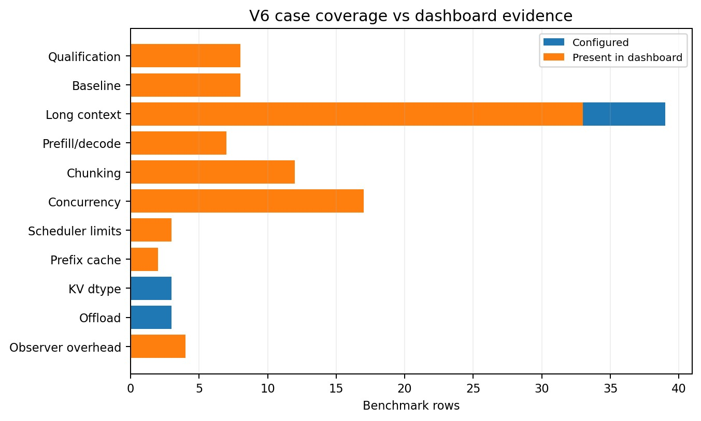

*Figure 1. Coverage in the archived V6 case matrix versus rows present in the current dashboard.*

**Interpretation:** The dashboard is complete for qualification/baseline/chunking/concurrency/scheduler/prefix/observer groups, but the FP8-KV and native-offload groups are absent. The long-context aggregate therefore remains incomplete.

---

## 2. Scope, source hierarchy, and validation status

- Primary UI source reviewed: `MASTER_CHARACTERIZATION_DASHBOARD.html` (2,523 lines; seven tabs).
- V6 archived case definition reviewed: `v5_vllm_profiling_suite_v6/rtx_g4_smoke_v5/10_vllm_surrogate_cases.json` and `10b_vllm_multi_node_cases.json`.
- Raw evidence locally available and previously audited: V6 qualification logs, manifests, benchmark JSON, server logs, Prometheus snapshots, and GPU telemetry.
- Historical V5 Option A/B/C archives were previously reviewed to identify profiler and multi-node pitfalls.
- External hardware check: NVIDIA specifies RTX PRO 6000 Blackwell Server Edition as 96GB GDDR7, PCIe Gen5 x16, 1597 GB/s memory bandwidth.
- vLLM semantics check: request-rate and max-concurrency are separate; `max_num_seqs` is an independent scheduler limit; explicit KV cache memory overrides `gpu_memory_utilization`; KV offload size is total across TP ranks in vLLM 0.29.0.

> **Raw-validation boundary.** The current HTML contains full-production values beyond the uploaded qualification package. Those values are useful for UI auditing, but must be linked to the final raw run manifest before the UI can label them as measured. Scale-out and profiler numbers require especially strict provenance.

---

## 3. What the current UI gets right

- The seven-tab information architecture is appropriate and should be retained.
- The dashboard separates scale-up, scale-out, long-context, scheduler/KV and profiler concerns instead of collapsing them into one benchmark page.
- The Evidence tab is the right concept for auditability; it should become the actual source-of-truth layer for every chart.
- The Executive page correctly tries to expose TTFT, TPOT, throughput, topology and runtime reserve rather than only GPU utilization.
- Qualification results show the harness can capture actual input-token lengths, TP4/TP8 metrics, KV peak, preemption state and warmup-separated benchmark results.
- The runtime accounting equation is directionally correct as a framework if overlap and residual are treated explicitly rather than force-fitting percentages.

---

## 4. Global UI corrections — implement before sign-off

| Pri | Issue | Current risk | Exact change |
|---|---|---|---|
| P0 | Hardware identity | Legacy Ada/48GB/Gen4 text exists. | Use detected GPU model + official Blackwell metadata: 96GB GDDR7, PCIe Gen5. Never hard-code capacity. |
| P0 | Dataset time/status | Header shows Apr 27, 2025 and "Live". | Show latest run timestamp and dashboard build time. Only show Live when polling active runs. |
| P0 | Evidence classes | Model metrics and hardware metrics are mixed. | `MEASURED-48B` = model/vLLM; `MEASURED-GCP-HW` = hardware/fabric; `DERIVED` = calculated; `LOCAL-REAL` = local K3 only; `UNRESOLVED` = missing. |
| P0 | Data binding | Chart arrays are embedded in JS. | Every point must be generated from result JSON with run_id/source_file/sample_count. |
| P0 | Missing values | Some charts interpolate or fill absent cells. | Render NOT RUN / NOT CAPTURED; never 0 or plausible filler. |
| P0 | Annotation language | Some cards say best/recommended/proves. | Use Observation -> Interpretation(confidence) -> Decision(workload-scoped) -> Next evidence. |
| P0 | Revision drift | Evidence includes 1M c4 not present in archived V6 case file. | Expose suite_version/git_SHA/case_manifest hash in header and Evidence tab. |

---

## 5. Executive tab — precise changes

| Action | Component | Instruction |
|---|---|---|
| KEEP | TP4 decode qualification card | Useful if explicitly scoped to matched measured points. |
| CHANGE | TP8 long-prefill card | Replace qualification-only wording now that 1M baseline is present; state TP8 lower TTFT at 512K and 1M c1 in current dashboard, but do not imply universal winner. |
| CHANGE | 8/8 qualification status | Replace top-level status with V6 coverage summary. Keep 8/8 as sub-card. |
| CHANGE | Serving envelope heatmap | Use only measured cells. Remove synthetic 32K/64K/256K values and unavailable concurrency cells. |
| CHANGE | Runtime reserve bar | Replace quantitative percentages with component ledger until profiler attribution is raw-validated. |
| ADD | Coverage strip | Configured / completed / failed / safety-skipped / not-run by test group. |
| ADD | Data freshness | Last run, suite revision, model revision, vLLM version, profiler status, scale-out raw-validation status. |

---

## 6. Scale-Up tab — measured behavior vs UI overreach

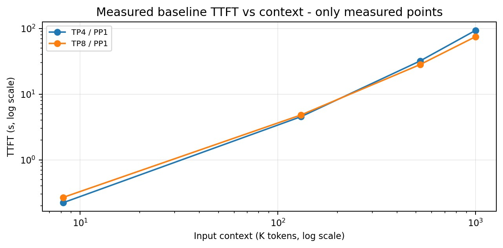

*Figure 2. Baseline TTFT uses only measured 8K, 128K, 512K and 1M points.*

**Interpretation:** The current UI should not insert 32K, 64K or 256K points into a chart labeled measured. If interpolation is useful, render it as a dashed DERIVED line.

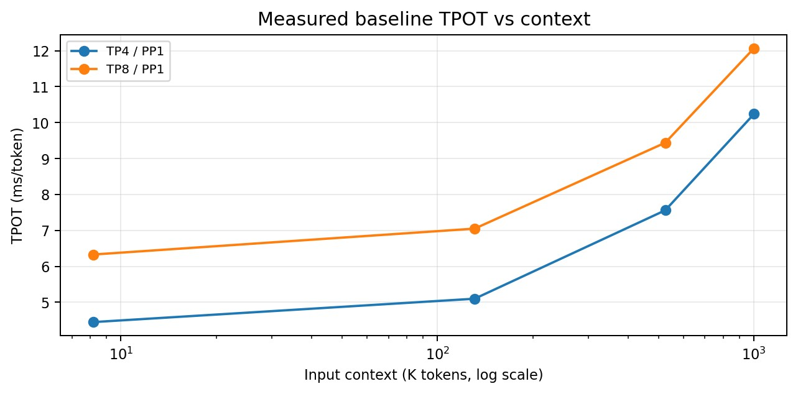

*Figure 3. Baseline TPOT by context.*

**Interpretation:** TP4 retains lower TPOT than TP8 at the measured baseline points, while TP8 has lower TTFT at 512K/1M. This is a prefill-vs-decode topology trade-off, not a universal TP winner.

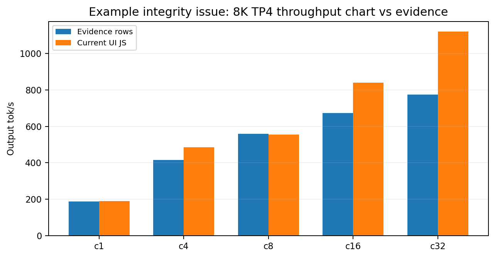

*Figure 4. Example of current UI hard-coded 8K TP4 throughput diverging from the Evidence table.*

**Interpretation:** At high concurrency, the dashboard JS overstates throughput relative to its own Evidence rows. All graphs must bind to the evidence database, not embedded arrays.

| Pri | Panel | Required change |
|---|---|---|
| P0 | TTFT curve | Remove invented 32K/64K/256K measured markers. Measured = 8K/128K/512K/1M. |
| P0 | "~350K crossover" | Change to "observed crossover bracket: between 128K and 512K". Fitted crossover must be DERIVED. |
| P0 | TPOT vs concurrency | Do not synthesize TP8 c2/c4/c16/c32. Separate TP4 full sweep from matched TP4-vs-TP8 points. |
| P0 | Throughput vs concurrency | Use exact Evidence rows. Add N, output length and closed-loop label to tooltip. |
| P0 | AllReduce graph | Source from V4/NCCL or profiler. Badge as MEASURED-GCP-HW or profile-derived; distinguish time/algbw/busbw. |
| P1 | Pareto view | Add throughput vs TPOT scatter by context/concurrency. This exposes the latency-throughput frontier. |
| P1 | Capacity knee | Mark point where throughput gain flattens while TPOT/TTFT rises sharply; do not call it max users. |

---

## 7. Serving-capacity analysis the UI should expose

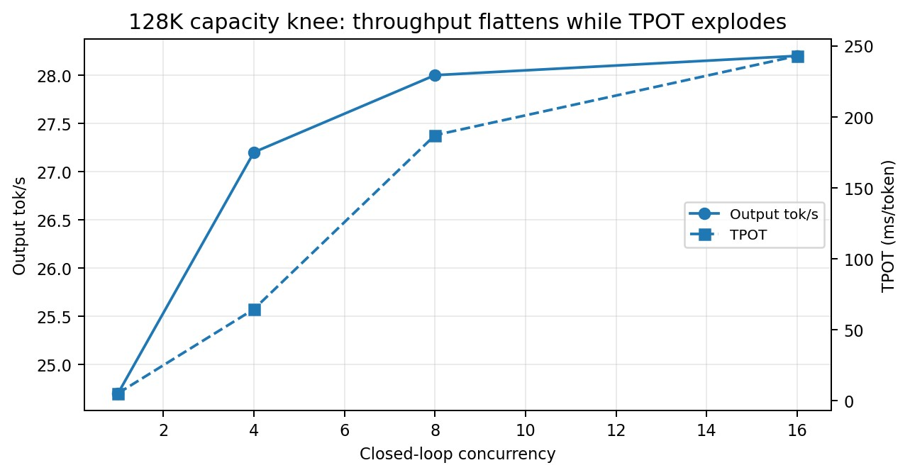

*Figure 5. 128K closed-loop capacity knee from dashboard Evidence rows.*

**Interpretation:** Throughput increases only from 24.7 to 28.2 tok/s between c1 and c16, while TPOT rises from 5.11 to 242.85 ms/token. The UI should highlight this as a latency-throughput trade-off, not successful scaling.

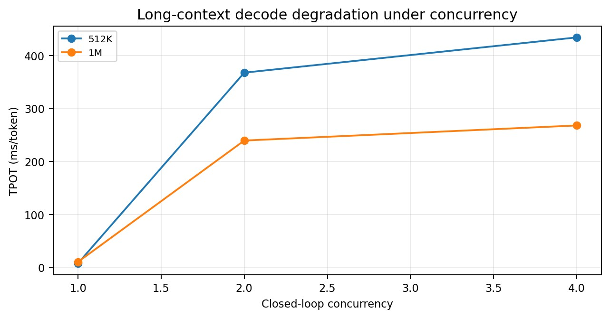

*Figure 6. Long-context TPOT degradation under concurrency.*

**Interpretation:** At 512K and 1M, c2/c4 do not increase the displayed output throughput materially, but TPOT increases by hundreds of milliseconds. This is a key serving-capacity result and should be above the fold in Scheduler & KV / Long Context.

> **Critical interpretation.** Closed-loop concurrency is not "number of users supported." `vllm bench serve` distinguishes max-concurrency from request-rate; request-rate=inf sends all requests immediately. Capacity must be expressed as a workload-specific envelope across context, output length, concurrency, offered RPS, queue, TTFT/TPOT SLO and KV/preemption state.

---

## 8. 1M context — deep audit and required UI treatment

> **1M status.** The dashboard contains substantial single-node 1M evidence. It does not establish a complete 1M matrix. Baseline TP4 c1 and TP8 c1 are present; TP4 prefill-focused, chunk-size, and closed-loop c1/c2/c4 are present. The archived V6 offload 1M case is absent from the dashboard; multi-node 1M is not part of the multi-node case matrix.

| Case | Bench | TP/PP | Conc. | TTFT | TPOT ms | Out tok/s | KV peak |
|---|---|---|---|---|---|---|---|
| tp4_context_baseline | 1m_c1 | TP4 / PP1 | c1 | 93.38s | 10.24 | 0.30 | 12.3% |
| tp8_context_baseline | 1m_c1 | TP8 / PP1 | c1 | 74.85s | 12.07 | 0.40 | 12.2% |
| tp4_prefill_focus | 1m_prefill | TP4 / PP1 | c1 | 93.35s | 10.64 | 0.00 | 12.3% |
| tp4_chunk4k | 1m_c1 | TP4 / PP1 | c1 | 122.10s | 10.28 | 0.10 | 12.2% |
| tp4_chunk8k | 1m_c1 | TP4 / PP1 | c1 | 93.38s | 10.37 | 0.20 | 12.3% |
| tp4_chunk16k | 1m_c1 | TP4 / PP1 | c1 | 89.16s | 10.26 | 0.20 | 12.5% |
| tp4_closedloop_1m | c1 | TP4 / PP1 | c1 | 93.46s | 10.20 | 0.30 | 12.3% |
| tp4_closedloop_1m | c2 | TP4 / PP1 | c2 | 150.65s | 239.25 | 0.30 | 15.5% |
| tp4_closedloop_1m | c4 | TP4 / PP1 | c4 | 231.50s | 267.69 | 0.30 | 15.5% |

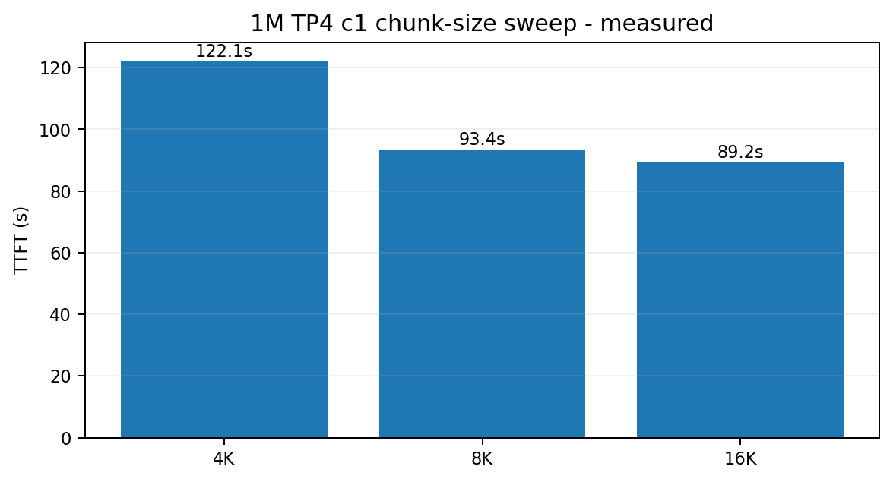

*Figure 7. 1M TP4 c1 chunk-size sweep.*

**Interpretation:** In the current evidence rows, 16K has the lowest TTFT (89.16s), 8K is 93.38s, and 4K is 122.10s. Therefore the current "8,192 sweet spot" claim is too strong without concurrent-decode/SLO context.

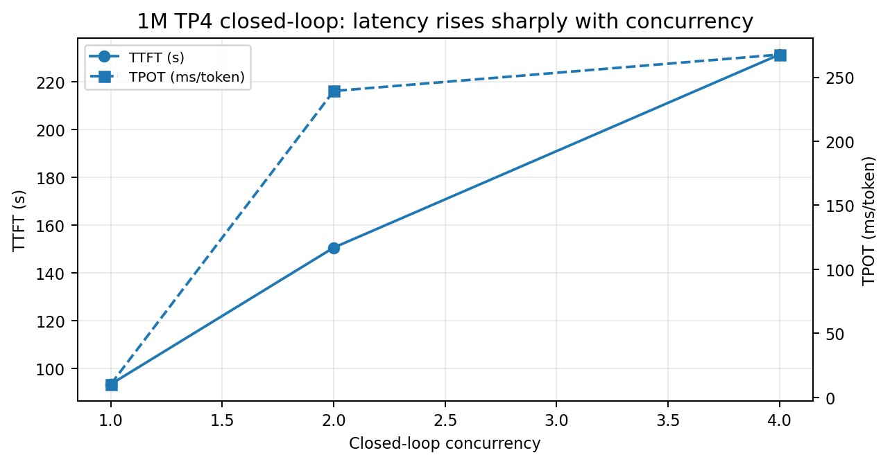

*Figure 8. 1M TP4 closed-loop concurrency.*

**Interpretation:** TTFT rises from 93.46s at c1 to 150.65s at c2 and 231.50s at c4; TPOT rises from 10.20ms to 239.25ms and 267.69ms. This must be one of the headline long-context charts.

| Pri | 1M item | Instruction |
|---|---|---|
| P0 | Feasibility KPI | Replace "100% Passed" with exact coverage: TP4/TP8 c1 baseline + TP4 c1/c2/c4 closed-loop completed. |
| P0 | Chunk KPI | Replace "8K sweet spot" with measured finding: 16K lowest 1M c1 TTFT among 4K/8K/16K. Add workload/SLO caveat. |
| P0 | Prefix 1M | Do not label 14.4s at 90% hit as measured unless a real 1M prefix run exists. Use 128K/512K cold-vs-repeat; 1M projection = DERIVED. |
| P0 | KV memory | Do not convert 12.3% utilization into 12.3GB. Show % unless configured KV bytes are verified. |
| P0 | Context curve | Remove synthetic 32K/64K/256K measured markers. |
| P1 | Regime-change panel | Plot per-prefill-chunk iteration time vs accumulated context together with GPU util, KV%, scheduler time, offload bytes/time and TP/NCCL contribution. |
| P1 | 1M boundary | Keep 1,000,000-token nominal test distinct from 1,048,576 model maximum. |
| P1 | Missing coverage | Show 1M offload as NOT RUN/NOT SURFACED; show 1M multi-node as NOT CONFIGURED unless added later. |

---

## 9. Scale-Out tab — deep correction specification

> **Important.** The Scale-Out tab was explicitly reviewed. Its topology intent is good, but several labels and causal claims are too strong. The current UI values below should remain **"current UI values pending raw production validation"** until each row is linked to its run manifest, rank placement, network fingerprint and source JSON.

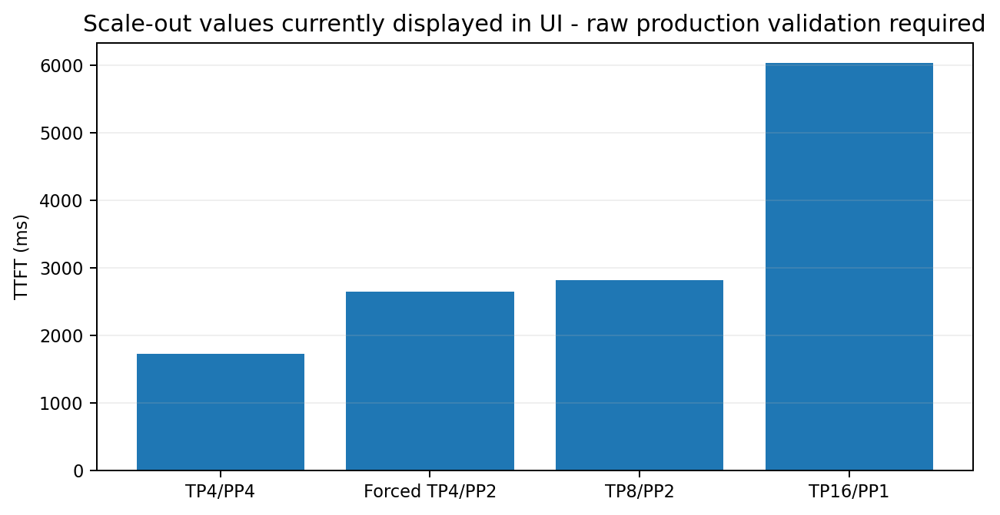

*Figure 9. 128K scale-out TTFT values currently displayed by the UI. (Bars: TP4/PP4, Forced TP4/PP2, TP8/PP2, TP16/PP1. Numeric values are not tabulated in the report — see `02b_chart_only_values.csv`.)*

**Interpretation:** These values are useful for comparison only after raw multi-node validation. The label must be `MEASURED-48B` when validated, not `MEASURED-GCP-HW`.

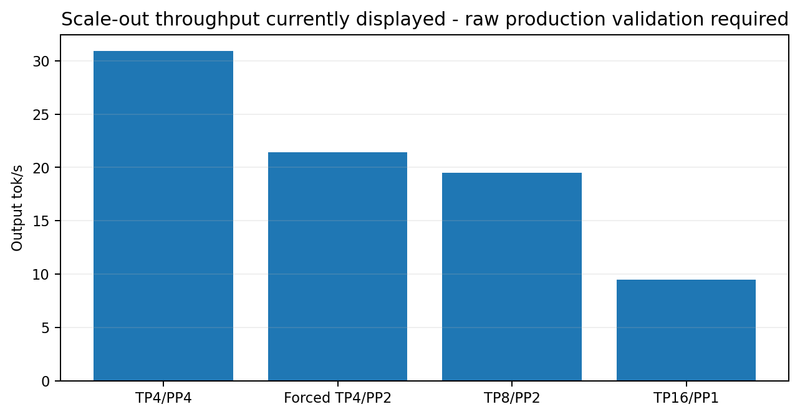

*Figure 10. Scale-out throughput values currently displayed by the UI.*

**Interpretation:** Do not infer that PP "masks" network latency from throughput alone. Confirm with NCCL and PP-stage timelines.

| Pri | Scale-out item | Instruction |
|---|---|---|
| P0 | TP16/PP1 diagram | Must show a TP16 group spanning Node0 and Node1; it is not "within nodes". |
| P0 | Forced TP4/PP2 diagram | Must show one TP4 stage on Node0 -> remote PP boundary -> one TP4 stage on Node1. Do not draw a split cross-node TP ring. |
| P0 | Top Distributed Topology | Replace universal winner with "lowest TTFT / highest throughput in matched 128K c1 test". |
| P0 | Causal language | Replace "Pipeline Parallelism Superiority" and "proves pipeline stages mask latency" with observation + medium-confidence interpretation + trace requirement. |
| P0 | Network traffic | Do not state 22.4GB/s saturation/TCP queues unless bytes/s, link capacity, retries/queue data prove it. |
| P0 | Evidence badge | TTFT/TPOT/tok/s = MEASURED-48B; network/MTU/iperf/NCCL primitive = MEASURED-GCP-HW. |
| P1 | Context selector | 128K and 512K for TP4/PP2, TP8/PP2, TP4/PP4 where run; TP16/PP1 512K = NOT RUN unless executed. |
| P1 | Placement audit | Render PP rank -> node -> GPU UUID -> PCI bus -> NUMA; PASS/FAIL placement validation. |
| P1 | Per-node balance | Show per-GPU mean/p95 utilization, memory, power and coefficient of variation; a range alone is insufficient. |
| P1 | Network fingerprint | Expose node zones, interface, MTU, RTT, iperf, cap, NCCL transport/plugin state beside each topology. |
| P1 | Topology decision view | Map workload regime to measured tradeoffs. No universal "recommended" label without an explicit objective/SLO. |

### 9.1 Correct topology semantics to show in UI

```
TP16 / PP1:      Node0 GPU0-7 <==== cross-node TP collectives ====> Node1 GPU0-7
TP8  / PP2:      Node0 [TP8 stage0] ---- PP boundary ----> Node1 [TP8 stage1]
TP4  / PP4:      Node0 [TP4 stage0][TP4 stage1] ---- PP ----> Node1 [TP4 stage2][TP4 stage3]
Forced TP4 / PP2: Node0 visible GPU0-3 [TP4 stage0] ---- PP ----> Node1 visible GPU0-3 [TP4 stage1]
```

---

## 10. Scheduler & KV tab — corrections and stronger analysis

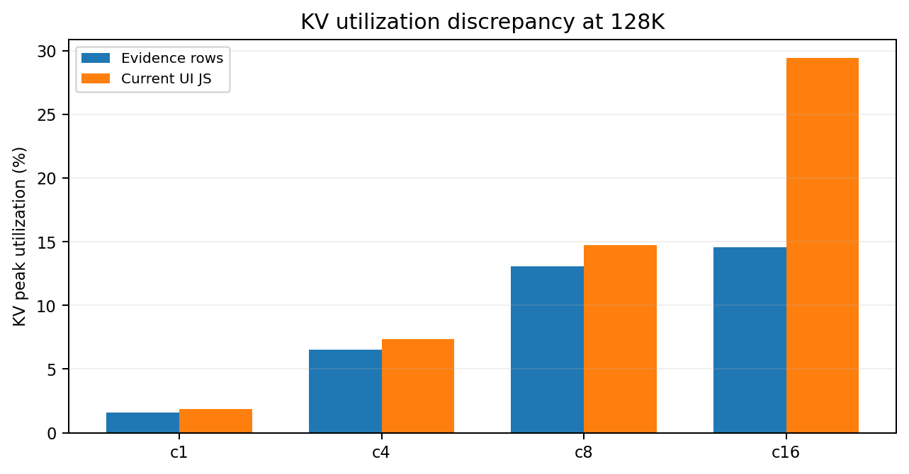

*Figure 11. Current KV-utilization chart conflicts with the Evidence table.*

**Interpretation:** At 128K c16 the current evidence row reports 14.6% KV peak, while the current chart logic scales to 29.44%. The chart must use exact `kv_peak_pct` rows, not synthetic multiplication.

| max_num_seqs | TTFT | TPOT ms | Out tok/s | KV peak |
|---|---|---|---|---|
| 4 | 88.007s | 433.81 | 2.0 | 12.9% |
| 8 | 87.994s | 433.76 | 2.0 | 12.9% |
| 16 | 87.975s | 433.77 | 2.0 | 12.9% |

> **Measured scheduler-limit result.** At 512K c4, `max_num_seqs` 4/8/16 produces nearly identical TTFT (~87.97–88.01s), TPOT (~433.76–433.81ms) and KV peak (12.9%) in the dashboard evidence. This is a valuable result: within this tested range, `max_num_seqs` was not the dominant limiter for that workload.

| Pri | Scheduler/KV item | Instruction |
|---|---|---|
| P0 | KV utilization | Use evidence row values only; 1M c4 is 15.5% in the current Evidence table, not 49.2%. |
| P0 | Scheduler overhead | Show <0.04ms only if parsed EngineCore iteration CPU time directly supports it; otherwise NOT CAPTURED. |
| P0 | Fragmentation | Show fragmentation only with a real fragmentation metric; block size alone does not prove <1.8%. |
| P0 | Percentiles | P95 requires >=20 samples; P99 >=100. Low-N long-context runs should show individual samples/min/median/max. |
| P1 | max_num_seqs chart | Promote the 512K c4 4/8/16 sweep as a dedicated chart and learning. |
| P1 | Capacity heatmap | Axes: context x closed-loop concurrency; cell color = TPOT or TTFT; overlay output tok/s and KV%; gray = not run. |
| P1 | Open-loop | Add request-rate vs achieved throughput/queue/TTFT page once RPS runs exist. Keep external users distinct from max concurrency. |

### 10.1 Prefix-cache and observability panels

| Case | Input | Aggregate TTFT | TPOT ms | Out tok/s | KV peak |
|---|---|---|---|---|---|
| tp4_prefix128k | 131,328 | 0.911s | 5.31 | 80.7 | 1.9% |
| tp4_prefix512k | 524,544 | 16.894s | 7.65 | 3.7 | 7.7% |

> **Prefix-cache UI rule.** Do not collapse a prefix-reuse case to a single aggregate mean. The graph must separate first/cold request from repeated/hit requests, report actual reused/computed token counts, and label the hit mechanism. The current evidence rows only expose aggregates.

| Observability | Bench | TTFT ms | TPOT ms | Out tok/s |
|---|---|---|---|---|
| minimal | 8k_c8 | 955.9 | 10.80 | 551.2 |
| minimal | 128k_c4 | 10289.9 | 66.77 | 27.2 |
| full | 8k_c8 | 954.0 | 10.70 | 555.4 |
| full | 128k_c4 | 10855.0 | 62.56 | 27.2 |

> **Observer overhead.** The full vs minimal observability cases should be retained as a quality-control panel. Their differences should be reported as percentage deltas with N and run-to-run variance before applying a blanket instrumentation correction.

---

## 11. Profiler & runtime reserve — redesign

> **Current profiler tab is not sign-off ready.** The page currently displays precise percentages for GPU, TP, PP, vLLM, CPU and overlap. Those values must be removed unless produced by the final profiler/timeline analyzer. In particular, a PP share cannot appear in a TP4/PP1 or TP8/PP1 single-node profile.

```
T_workload = A_GPU + B_TP + C_PP + D_PCIe/offload + E_vLLM + F_CPU/launch + G_other - O_overlap
```

| Term | Meaning | Required source | Status type |
|---|---|---|---|
| A_GPU | KDA/MLA/MoE/GEMM/norm kernels on critical path | Nsight CUDA timeline + NVTX ranges | Timeline-attributed |
| B_TP | TP collectives that serialize/overlap with compute | Nsight NCCL + rank-normalized timeline; V4 NCCL only as primitive reference | Timeline-attributed / derived |
| C_PP | PP send/recv + stage idle/bubble | PP>1 profile with stage/rank timestamps | Timeline-attributed |
| D_PCIe/offload | H2D/D2H and CPU KV offload | vLLM offload bytes/time + CUDA memcpy timeline | Measured + timeline |
| E_vLLM | queue, scheduler, KV block manager, admission | Prometheus + EngineCore iteration details | Directly measured where parsed |
| F_CPU/launch | CUDA API/driver launch/Python/Ray overhead | Nsight CPU/CUDA API timeline | Timeline-attributed |
| G_other | tokenization, unexplained runtime/residual | Residual after validated buckets | Unresolved/derived |
| O_overlap | concurrent GPU/NCCL/memcpy/runtime work | Critical-path timeline overlap | Timeline-attributed subtraction |

**Rules (do NOT):**
- Do not add aggregate kernel durations across 4/8/16 ranks and call the sum wall-clock latency.
- Do not count HBM/memory traffic separately when it is already included inside GEMM/kernel elapsed time, unless using a roofline model rather than a latency sum.
- Do not count cross-NUMA P2P again when it is already embodied in measured NCCL collective time.
- Do not count PP transfer and the full pipeline bubble as two independent additive terms when they overlap.
- Do not force the components to sum to TTFT/TPOT. The unexplained remainder must remain Other/Unresolved.

| Pri | Profiler item | Instruction |
|---|---|---|
| P0 | SM efficiency 74.2% | Remove unless Nsight/CUPTI metric source is present. |
| P0 | TP overhead 21.8% / 11.2% | Remove unless computed from rank-normalized critical-path NCCL attribution. |
| P0 | vLLM runtime 14% | Remove unless queue/scheduler/runtime ranges directly support it. |
| P0 | Overlap 12.6% | Remove unless calculated from timeline overlap. |
| P0 | PP 8.2% | Set N/A on PP1; only populate PP>1 runs. |
| P0 | VRAM doughnut | Use actual Blackwell 96GB-class capacity and measured/reserved pools, not 48GB. |
| P0 | PCIe plot | Use PCIe Gen5 and V4 measured H2D/D2H if available; badge as MEASURED-GCP-HW. |
| P1 | Trace completeness | Show ranks expected/captured, Nsight version, NCCL trace mode, enforce-eager, warm/cold state. |
| P1 | Phase selector | Prefill / decode / batched-decode; matched TP4 vs TP8 profile. |

---

## 12. Evidence tab — make it the source of truth

> **Coverage finding.** Archived V6 single-node matrix defines **64** benchmark rows. The dashboard exposes **59** evidence rows. Six configured rows are absent (3 FP8-KV + 3 native-offload), while one extra row (`tp4_closedloop_1m` / c4) appears beyond the archived case file. This is a classic revision-drift signal and must be made visible.

| Missing configured case | Benchmark |
|---|---|
| tp4_fp8_kv | 128k_c1 |
| tp4_fp8_kv | 128k_c4 |
| tp4_fp8_kv | 512k_c1 |
| tp4_native_offload_pressure | 128k_c1 |
| tp4_native_offload_pressure | 512k_c1 |
| tp4_native_offload_pressure | 1m_c1 |

> **Extra evidence row.** `tp4_closedloop_1m` / c4 is present in the dashboard but not in the archived V6 case definition. This likely reflects a later matrix update and is useful evidence, but the UI must identify the suite revision that created it.

| Pri | Evidence function | Instruction |
|---|---|---|
| P0 | Coverage KPIs | Configured / started / completed / failed / safety-skipped / not-run, by group. |
| P0 | Source pointer | run_id, source_file, case_manifest hash, suite_version/git SHA on every row. |
| P0 | Actual workload | actual_input_tokens, output_tokens, sample count N, request_rate, max_concurrency, max_num_seqs, max_num_batched_tokens. |
| P0 | Config state | TP/PP, GPU set, KV dtype, prefix cache, offload, chunk budget, observability profile. |
| P0 | Multi-node | Include multi-node rows in the same evidence database or a dedicated source selector. |
| P1 | Filters | Generate context filters from actual values; remove synthetic 32K/64K/256K choices when no run exists. |
| P1 | Click-through | Click any chart point to open its evidence row and raw artifact path. |

---

## 13. Final page architecture and required charts

| Tab | Above-the-fold charts/KPIs | Architectural question |
|---|---|---|
| Executive | TTFT, TPOT, achieved output tok/s, queue, KV%, coverage status | Measured-only serving envelope; workload-scoped findings; data freshness. |
| Scale-Up | TTFT vs context; TPOT vs context; closed-loop concurrency; throughput-vs-latency Pareto; NCCL primitive | TP4/TP8 trade-off and capacity knee. |
| Scale-Out | 128K/512K topology selector; TTFT/TPOT/tok/s; rank placement; network fingerprint; per-GPU balance | TP-vs-PP/network trade-off without universal ranking. |
| Long Context | 1M baseline; 4K/8K/16K chunk; c1/c2/c4; per-chunk time vs accumulated context; prefix reuse | Identify regime change and long-context capacity collapse. |
| Scheduler & KV | KV%, running/waiting, queue, preemptions, max_num_seqs sweep, open-loop load once available | Admission/capacity mechanism, not "max users". |
| Profiler | Timeline, kernel/NCCL attribution, CPU/API, overlap, residual, trace completeness | Root-cause TTFT/TPOT breakdown. |
| Evidence | All run rows + provenance + raw paths + coverage accounting | Auditability and zero silent interpolation. |

---

## 14. Mandatory annotation format below every graph

**Template:**
`Observation:` literal measured result.
`Interpretation [High/Medium/Low]:` plausible mechanism.
`Decision:` workload-scoped implication.
`Next evidence:` trace/test needed to confirm causality.
`Evidence:` source class + run IDs + N.

- Never write "proves" when a graph only establishes correlation.
- Never write "best" without defining the workload and objective (TTFT, TPOT, throughput, memory, cost, or network sensitivity).
- Never call closed-loop concurrency "users". If open-loop RPS exists, show offered load and achieved load separately.
- Never mix surrogate `MEASURED-48B` absolute performance with `MODELED-K3` projections.

---

## 15. Minimum JSON schema required by the UI

| Domain | Required fields |
|---|---|
| identity | run_id, suite_version, git_sha, timestamp, hostname, zone |
| model | model_id, revision, dtype/quantization, vllm_version, torch/cuda/nccl/flashinfer versions |
| topology | tp, pp, dp, gpu_indices, rank_to_node_gpu, numa, network_transport |
| workload | input_tokens_actual, output_tokens_actual, max_concurrency, request_rate, burstiness, num_prompts, sample_count |
| scheduler | max_num_batched_tokens, max_num_seqs, max_num_active_seqs, running, waiting, queue_time |
| cache | kv_cache_dtype, kv_peak_pct, prefix_hits/query/computed_tokens, preemptions, offload_bytes/time |
| service | ttft_mean/p50/p95/p99, tpot/itl, e2e, request_tps, input_tps, output_tps, failures |
| hardware | gpu_uuid, util, mem_used, power, clock; network RTT/iperf/MTU/cap; V4 primitives |
| profiler | profile_mode, ranks_expected/captured, kernel/NCCL timeline buckets, CPU/API, idle, overlap, residual |
| evidence | evidence_class, source_file, parser_version, validation_status, raw_artifact_path |

---

## 16. Sign-off acceptance checklist

(Also available standalone as `04_acceptance_checklist.md`.)

- [ ] No chart contains a numeric point that cannot be resolved to an evidence row or an explicitly DERIVED formula.
- [ ] No missing/not-run condition is rendered as zero.
- [ ] All 1M panels distinguish baseline c1, TP4 closed-loop c1/c2/c4, chunking, missing offload, and absent/not-configured scale-out coverage.
- [ ] TP16/PP1 and forced TP4/PP2 topology diagrams correctly reflect cross-node communication semantics.
- [ ] Every scale-out result shows rank placement and network provenance next to the performance result.
- [ ] Profiler page contains no precise decomposition percentage until trace-derived attribution is available.
- [ ] Hardware label is RTX PRO 6000 Blackwell Server Edition, 96GB GDDR7, PCIe Gen5; no Ada/48GB/Gen4 residue remains.
- [ ] Percentile charts enforce N thresholds and show N in tooltips.
- [ ] Every chart uses Observation / Interpretation / Decision / Next evidence language.
- [ ] Evidence tab displays suite revision and coverage counts by group.
- [ ] Clicking a chart point can navigate to its evidence row/raw source.
- [ ] Absolute 48B surrogate latency/tok/s is never presented as Kimi K3 performance.

---

## 17. Source register

| ID | Source | Use |
|---|---|---|
| S1 | MASTER_CHARACTERIZATION_DASHBOARD.html | Uploaded current UI, 2,523 lines; all seven tabs audited. |
| S2 | v6_qualification_results_with_logs.zip | Raw qualification manifests, benchmark JSON, server logs, metrics and GPU telemetry; qualification values previously validated. |
| S3 | v5_vllm_profiling_suite_v6.tar.gz | Archived V6 single-node and multi-node case definitions used for coverage comparison. |
| S4 | NVIDIA RTX PRO 6000 Blackwell Server Edition official page | 96GB GDDR7, PCIe Gen5 x16, 1597 GB/s memory bandwidth. |
| S5 | vLLM 0.29/stable documentation | bench serve request-rate/max-concurrency; cache/offload semantics; max_num_seqs scheduler semantics. |

- NVIDIA: https://www.nvidia.com/en-us/data-center/rtx-pro-6000-blackwell-server-edition/
- vLLM bench serve: https://docs.vllm.ai/en/stable/cli/bench/serve/
- vLLM cache config 0.29.0: https://docs.vllm.ai/en/v0.29.0/api/vllm/config/cache/
- vLLM serve scheduler arguments: https://docs.vllm.ai/en/stable/cli/serve/

---

## Appendix A. Master UI remediation matrix

| Tab | Pri | Change | Exact instruction |
|---|---|---|---|
| GLOBAL | P0 | Replace legacy Ada/48GB/Gen4 labels | Use Blackwell Server Edition/96GB/Gen5 from detected inventory. |
| GLOBAL | P0 | Remove hard-coded measured arrays | Bind all plots to source JSON/evidence rows. |
| GLOBAL | P0 | Correct badge taxonomy | MEASURED-48B vs MEASURED-GCP-HW vs DERIVED/UNRESOLVED. |
| EXEC | P0 | Replace 8/8 top-level status | V6 configured/completed/failed/gated/not-run. |
| EXEC | P0 | Measured-only serving envelope | No synthetic contexts/concurrency cells. |
| SCALE-UP | P0 | Measured-only context points | 8K/128K/512K/1M; interpolation dashed/derived. |
| SCALE-UP | P0 | Crossover wording | Bracket 128K-512K; fitted point derived. |
| SCALE-UP | P0 | Matched TP4/TP8 concurrency | No synthetic TP8 c2/c4/c16/c32. |
| SCALE-UP | P0 | NCCL evidence source | Use V4/Nsight, separate time/algbw/busbw. |
| SCALE-OUT | P0 | Correct TP16 topology | Cross-node TP16 ring. |
| SCALE-OUT | P0 | Correct forced TP4/PP2 | TP4 per node + PP boundary, no split TP ring. |
| SCALE-OUT | P0 | Remove universal verdict | Scope to matched context/concurrency/objective. |
| SCALE-OUT | P0 | Remove unsupported network causality | Require raw traffic/cap/retry/queue evidence. |
| SCALE-OUT | P1 | Add rank placement validation | Rank->node->GPU UUID->PCI->NUMA. |
| SCALE-OUT | P1 | Add 128K/512K selector | Show NOT RUN where absent. |
| LONG | P0 | Reword 1M feasibility | Specify exact passed matrix, not 100% blanket. |
| LONG | P0 | Correct chunk finding | 16K lowest 1M c1 TTFT among tested chunks. |
| LONG | P0 | Correct prefix evidence | Use measured 128K/512K cold-vs-hit; 1M is derived unless run. |
| LONG | P0 | Correct KV units | Show %, not GB, unless bytes verified. |
| LONG | P1 | Add regime-change panel | Chunk iteration time vs accumulated context + runtime signals. |
| SCHED | P0 | Correct KV chart values | Use evidence values; no linear extrapolation. |
| SCHED | P0 | Gate percentile reporting | P95 N>=20; P99 N>=100. |
| SCHED | P1 | Promote max_num_seqs sweep | 512K c4 4/8/16 dedicated learning. |
| PROF | P0 | Remove fabricated percentages | Keep equation + unresolved ledger until trace data. |
| PROF | P0 | No PP share in PP1 profile | PP=N/A for single-node PP1. |
| PROF | P0 | Correct VRAM/PCIe | 96GB-class + PCIe Gen5. |
| PROF | P1 | Add trace completeness | Ranks captured, trace mode, warm/cold, eager/graph. |
| EVIDENCE | P0 | Coverage by group | Configured/started/completed/failed/gated/not-run. |
| EVIDENCE | P0 | Show revision drift | Suite/git SHA + manifest hash. |
| EVIDENCE | P0 | Include multi-node/profiler sources | Unified evidence layer. |
| EVIDENCE | P1 | Click-through traceability | Chart point -> evidence row -> raw artifact. |

---

## Appendix B. Current dashboard Evidence rows (59)

**Interpretation rule.** These are the rows embedded in the current dashboard. Their presence in the UI is not equivalent to raw-log validation. Qualification rows were previously raw-validated; full-production rows should retain source paths/run IDs so the same audit can be repeated.

*The full table is generated from `02_evidence_rows.csv` and appended below so this file is self-contained.*


| Case | Bench | TP/PP | Input | Conc | TTFT ms | TPOT ms | Out tok/s | KV peak | Status |
|---|---|---|---|---|---|---|---|---|---|
| tp4_qualification | 8k_c1 | TP4 / PP1 | 8,192 | c1 | 224.3 | 4.45 | 188.4 | 0.1% | COMPLETED |
| tp4_qualification | 8k_c8 | TP4 / PP1 | 8,192 | c8 | 956.5 | 10.70 | 555.0 | 1.0% | COMPLETED |
| tp4_qualification | 128k_c1 | TP4 / PP1 | 131,072 | c1 | 4534.1 | 5.08 | 24.7 | 1.6% | COMPLETED |
| tp4_qualification | 512k_c1 | TP4 / PP1 | 524,288 | c1 | 31955.5 | 7.58 | 2.0 | 6.5% | COMPLETED |
| tp8_qualification | 8k_c1 | TP8 / PP1 | 8,192 | c1 | 267.7 | 6.35 | 135.7 | 0.1% | COMPLETED |
| tp8_qualification | 8k_c8 | TP8 / PP1 | 8,192 | c8 | 1036.0 | 13.92 | 445.8 | 0.9% | COMPLETED |
| tp8_qualification | 128k_c1 | TP8 / PP1 | 131,072 | c1 | 4819.6 | 7.03 | 22.4 | 1.6% | COMPLETED |
| tp8_qualification | 512k_c1 | TP8 / PP1 | 524,288 | c1 | 28216.8 | 9.47 | 2.2 | 6.4% | COMPLETED |
| tp4_context_baseline | 8k_c1 | TP4 / PP1 | 8,192 | c1 | 222.3 | 4.45 | 162.4 | 0.1% | COMPLETED |
| tp4_context_baseline | 128k_c1 | TP4 / PP1 | 131,072 | c1 | 4540.8 | 5.10 | 24.7 | 1.6% | COMPLETED |
| tp4_context_baseline | 512k_c1 | TP4 / PP1 | 524,288 | c1 | 31978.5 | 7.56 | 2.0 | 6.5% | COMPLETED |
| tp4_context_baseline | 1m_c1 | TP4 / PP1 | 1,000,000 | c1 | 93384.5 | 10.24 | 0.3 | 12.3% | COMPLETED |
| tp8_context_baseline | 8k_c1 | TP8 / PP1 | 8,192 | c1 | 267.6 | 6.33 | 119.5 | 0.1% | COMPLETED |
| tp8_context_baseline | 128k_c1 | TP8 / PP1 | 131,072 | c1 | 4824.3 | 7.05 | 22.4 | 1.6% | COMPLETED |
| tp8_context_baseline | 512k_c1 | TP8 / PP1 | 524,288 | c1 | 28166.5 | 9.44 | 2.2 | 6.4% | COMPLETED |
| tp8_context_baseline | 1m_c1 | TP8 / PP1 | 1,000,000 | c1 | 74850.3 | 12.07 | 0.4 | 12.2% | COMPLETED |
| tp4_prefill_focus | 8k_prefill | TP4 / PP1 | 8,192 | c1 | 223.0 | 4.38 | 16.9 | 0.0% | COMPLETED |
| tp4_prefill_focus | 128k_prefill | TP4 / PP1 | 131,072 | c1 | 4542.1 | 5.09 | 0.9 | 1.6% | COMPLETED |
| tp4_prefill_focus | 512k_prefill | TP4 / PP1 | 524,288 | c1 | 31960.1 | 7.84 | 0.1 | 6.4% | COMPLETED |
| tp4_prefill_focus | 1m_prefill | TP4 / PP1 | 1,000,000 | c1 | 93354.2 | 10.64 | 0.0 | 12.3% | COMPLETED |
| tp4_decode_focus | 8k_decode_c1 | TP4 / PP1 | 8,192 | c1 | 225.6 | 4.47 | 204.0 | 0.1% | COMPLETED |
| tp4_decode_focus | 8k_decode_c8 | TP4 / PP1 | 8,192 | c8 | 957.2 | 9.23 | 721.0 | 1.0% | COMPLETED |
| tp4_decode_focus | 8k_decode_c16 | TP4 / PP1 | 8,192 | c16 | 1242.6 | 15.64 | 885.1 | 2.0% | COMPLETED |
| tp4_chunk4k | 128k_c1 | TP4 / PP1 | 131,072 | c1 | 5235.5 | 5.13 | 11.5 | 1.6% | COMPLETED |
| tp4_chunk4k | 128k_c4 | TP4 / PP1 | 131,072 | c4 | 11475.9 | 142.05 | 12.2 | 4.8% | COMPLETED |
| tp4_chunk4k | 512k_c1 | TP4 / PP1 | 524,288 | c1 | 40307.2 | 7.57 | 0.8 | 6.4% | COMPLETED |
| tp4_chunk4k | 1m_c1 | TP4 / PP1 | 1,000,000 | c1 | 122103.8 | 10.28 | 0.1 | 12.2% | COMPLETED |
| tp4_chunk8k | 128k_c1 | TP4 / PP1 | 131,072 | c1 | 4544.5 | 5.11 | 13.2 | 1.6% | COMPLETED |
| tp4_chunk8k | 128k_c4 | TP4 / PP1 | 131,072 | c4 | 10928.1 | 117.39 | 13.9 | 6.5% | COMPLETED |
| tp4_chunk8k | 512k_c1 | TP4 / PP1 | 524,288 | c1 | 31966.6 | 7.58 | 1.0 | 6.5% | COMPLETED |
| tp4_chunk8k | 1m_c1 | TP4 / PP1 | 1,000,000 | c1 | 93375.9 | 10.37 | 0.2 | 12.3% | COMPLETED |
| tp4_chunk16k | 128k_c1 | TP4 / PP1 | 131,072 | c1 | 4366.5 | 5.09 | 13.7 | 1.7% | COMPLETED |
| tp4_chunk16k | 128k_c4 | TP4 / PP1 | 131,072 | c4 | 10922.1 | 106.51 | 14.5 | 6.6% | COMPLETED |
| tp4_chunk16k | 512k_c1 | TP4 / PP1 | 524,288 | c1 | 30498.9 | 7.54 | 1.0 | 6.6% | COMPLETED |
| tp4_chunk16k | 1m_c1 | TP4 / PP1 | 1,000,000 | c1 | 89164.1 | 10.26 | 0.2 | 12.5% | COMPLETED |
| tp4_closedloop_8k | c1 | TP4 / PP1 | 8,192 | c1 | 224.9 | 4.47 | 187.6 | 0.1% | COMPLETED |
| tp4_closedloop_8k | c4 | TP4 / PP1 | 8,192 | c4 | 610.8 | 7.27 | 415.3 | 0.5% | COMPLETED |
| tp4_closedloop_8k | c8 | TP4 / PP1 | 8,192 | c8 | 916.5 | 10.73 | 559.7 | 1.0% | COMPLETED |
| tp4_closedloop_8k | c16 | TP4 / PP1 | 8,192 | c16 | 1155.8 | 19.27 | 673.2 | 2.0% | COMPLETED |
| tp4_closedloop_8k | c32 | TP4 / PP1 | 8,192 | c32 | 1623.7 | 34.96 | 774.4 | 4.0% | COMPLETED |
| tp4_closedloop_128k | c1 | TP4 / PP1 | 131,072 | c1 | 4538.8 | 5.11 | 24.7 | 1.6% | COMPLETED |
| tp4_closedloop_128k | c4 | TP4 / PP1 | 131,072 | c4 | 10596.0 | 64.37 | 27.2 | 6.5% | COMPLETED |
| tp4_closedloop_128k | c8 | TP4 / PP1 | 131,072 | c8 | 12722.5 | 186.98 | 28.0 | 13.1% | COMPLETED |
| tp4_closedloop_128k | c16 | TP4 / PP1 | 131,072 | c16 | 37256.6 | 242.85 | 28.2 | 14.6% | COMPLETED |
| tp4_closedloop_512k | c1 | TP4 / PP1 | 524,288 | c1 | 32028.5 | 7.56 | 2.0 | 6.5% | COMPLETED |
| tp4_closedloop_512k | c2 | TP4 / PP1 | 524,288 | c2 | 40299.2 | 367.40 | 2.0 | 12.8% | COMPLETED |
| tp4_closedloop_512k | c4 | TP4 / PP1 | 524,288 | c4 | 87703.8 | 433.95 | 2.0 | 12.9% | COMPLETED |
| tp4_closedloop_1m | c1 | TP4 / PP1 | 1,000,000 | c1 | 93460.4 | 10.20 | 0.3 | 12.3% | COMPLETED |
| tp4_closedloop_1m | c2 | TP4 / PP1 | 1,000,000 | c2 | 150654.3 | 239.25 | 0.3 | 15.5% | COMPLETED |
| tp4_closedloop_1m | c4 | TP4 / PP1 | 1,000,000 | c4 | 231503.5 | 267.69 | 0.3 | 15.5% | COMPLETED |
| tp4_512k_maxseq4 | 512k_c4 | TP4 / PP1 | 524,288 | c4 | 88007.1 | 433.81 | 2.0 | 12.9% | COMPLETED |
| tp4_512k_maxseq8 | 512k_c4 | TP4 / PP1 | 524,288 | c4 | 87994.3 | 433.76 | 2.0 | 12.9% | COMPLETED |
| tp4_512k_maxseq16 | 512k_c4 | TP4 / PP1 | 524,288 | c4 | 87974.9 | 433.77 | 2.0 | 12.9% | COMPLETED |
| tp4_prefix128k | prefix128k | TP4 / PP1 | 131,328 | c1 | 910.7 | 5.31 | 80.7 | 1.9% | COMPLETED |
| tp4_prefix512k | prefix512k | TP4 / PP1 | 524,544 | c1 | 16894.4 | 7.65 | 3.7 | 7.7% | COMPLETED |
| tp4_observer_minimal | 8k_c8 | TP4 / PP1 | 8,192 | c8 | 955.9 | 10.80 | 551.2 | 1.0% | COMPLETED |
| tp4_observer_minimal | 128k_c4 | TP4 / PP1 | 131,072 | c4 | 10289.9 | 66.77 | 27.2 | 6.5% | COMPLETED |
| tp4_observer_full | 8k_c8 | TP4 / PP1 | 8,192 | c8 | 954.0 | 10.70 | 555.4 | 1.0% | COMPLETED |
| tp4_observer_full | 128k_c4 | TP4 / PP1 | 131,072 | c4 | 10855.0 | 62.56 | 27.2 | 6.5% | COMPLETED |

---

## Appendix C. 1M and Scale-Out developer checklist

> **1M must remain explicit.** Show: TP4 c1, TP8 c1, TP4 c1/c2/c4 closed-loop, 4K/8K/16K chunking, prefill-focused. Show native-offload 1M as missing/not surfaced. Do not imply 1M multi-node coverage unless separately added and run.

> **Scale-Out must remain auditable.** For each topology show 128K/512K result availability, rank placement, GCP zone/interface/RTT/MTU/iperf, NCCL transport, TTFT/TPOT/output tok/s, per-node balance, and trace completeness. Do not call the GCP result a local 10GbE prediction.

| Area | Must show | Must not claim |
|---|---|---|
| 1M baseline | TP4 c1 + TP8 c1 exact TTFT/TPOT/output TPS/KV% | 100% of all 1M serving configurations validated |
| 1M concurrency | TP4 c1/c2/c4 TTFT + TPOT + throughput + KV% | c4 is healthy merely because it completed |
| 1M chunking | 4K/8K/16K measured TTFT; workload/SLO context | 8K is universally optimal |
| 1M prefix/offload | Measured prefix/offload rows or NOT RUN | projected cache speedup as measured |
| Scale-out topology | rank placement + 128K/512K metrics + network provenance | universal winner independent of workload |
| Network | RTT/iperf/MTU/cap/NCCL transport | VPC saturation/TCP queues without direct evidence |
| Profiler | timeline-attributed GPU/NCCL/CPU/overlap/residual | aggregate kernel sums as wall-clock decomposition |
